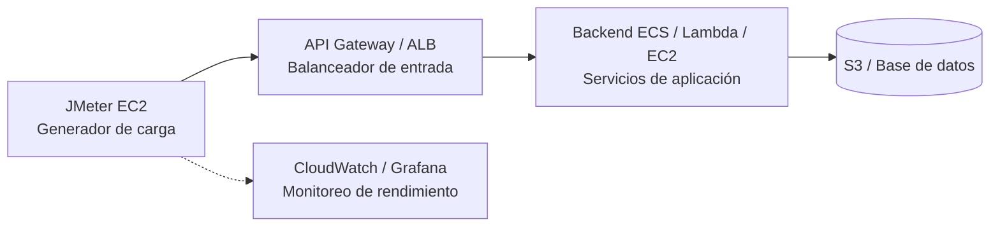

# Plan de Pruebas de Carga – ANB_App_API

**Proyecto:** Asociación Nacional de Baloncesto (ANB)  
**Herramienta:** Apache JMeter  
---

## 🎯 1. Objetivos

- Diseñar y documentar escenarios de **carga y estrés** para rutas críticas (web y batch).  
- Medir **throughput**, **tiempos de respuesta** y **utilización de recursos**.  
- Dejar configurada la infraestructura para las entregas futuras (2 a 5).

---

## ⚙️ 2. Alcance funcional

Endpoints incluidos:

| Grupo | Endpoint | Método | Descripción |
|--------|-----------|---------|-------------|
| Autenticación | `/api/auth/signup` | POST | Registro de jugadores |
| Autenticación | `/api/auth/login` | POST | Inicio de sesión |
| Videos | `/api/videos/upload` | POST | Subida de video |
| Videos | `/api/videos` | GET | Listado de videos del usuario |
| Videos | `/api/videos/{id}` | GET/DELETE | Detalle o eliminación |
| Público | `/api/public/videos` | GET | Lista de videos públicos |
| Público | `/api/public/videos/{id}/vote` | POST | Votar un video |
| Ranking | `/api/public/rankings` | GET | Ranking general |

---

## 🧠 3. Entorno de pruebas

**Infraestructura de prueba:**
- Instancia EC2: `m5.large` (2 vCPU, 8 GB RAM)
- Región: `us-east-1`
- Herramientas: Apache JMeter (CLI y GUI), Docker opcional
- Monitoreo: AWS CloudWatch (CPU, RAM, red), opcional InfluxDB + Grafana

---

## 🌐 3.1. Topología del entorno de prueba

La **topología** describe cómo se conectan los distintos componentes durante la ejecución de las pruebas de carga.

- **Cliente de carga:** instancia EC2 dedicada que ejecuta JMeter.  
- **Balanceador / API Gateway:** punto de entrada de la aplicación (recibe las peticiones).  
- **Backend:** servicios que procesan la lógica del API (ECS, Lambda o EC2).  
- **Almacenamiento:** buckets S3 y base de datos relacional o NoSQL.  
- **Monitoreo:** métricas recolectadas desde CloudWatch y, opcionalmente, Grafana.

**Diagrama de topología:**


## 📊 4. Métricas y criterios de aceptación

Las pruebas de carga evaluarán el desempeño del sistema en función de **tres métricas principales**:  
**throughput (capacidad de procesamiento)**, **tiempo de respuesta** y **utilización de recursos**, tal como lo indica la guía institucional.

---

### 🔹 Métricas principales

| Métrica | Descripción | Fuente / Herramienta |
|----------|--------------|----------------------|
| **Throughput** | Número de peticiones procesadas por segundo. Mide la capacidad de procesamiento del sistema. | JMeter Summary Report |
| **Tiempo de respuesta (avg, P95, P99)** | Tiempo transcurrido desde que el usuario envía una solicitud hasta recibir la respuesta completa. | JMeter HTML Report |
| **Tasa de errores (%)** | Porcentaje de respuestas HTTP con errores (4xx, 5xx) respecto al total de peticiones. | JMeter Summary Report |
| **Utilización de recursos** | Porcentaje de uso de CPU, memoria y red del backend durante la carga. | AWS CloudWatch o Grafana |

---

### 🎯 Criterios de aceptación

Estos criterios definen los umbrales de desempeño esperados para considerar las pruebas exitosas:

| Escenario / Endpoint | Criterio P95 | Tasa de errores | Restricciones de recursos |
|----------------------|-------------:|----------------:|---------------------------|
| **Login** | < 2 segundos | < 1% | CPU < 70%, RAM < 75% |
| **Upload (video pequeño)** | < 4 segundos | < 2% | CPU < 80%, RAM < 80% |
| **Listados / Detalle de videos** | < 2.5 segundos | < 1% | CPU < 70%, RAM < 75% |
| **Batch / Procesamiento asíncrono** | < 6 segundos | < 3% | CPU < 85%, RAM < 85% |

---

### 📈 Métricas adicionales recomendadas

- **Throughput sostenido mínimo:** ≥ 50 solicitudes por segundo.  
- **Disponibilidad:** ≥ 99% durante la duración de la prueba.  
- **Picos de carga tolerables:** El sistema no debe degradarse drásticamente cuando la concurrencia se duplica.  
- **Escalabilidad:** La relación entre usuarios concurrentes y throughput debe mantenerse casi lineal hasta la carga nominal.

---

## 5. Escenarios de prueba

Los escenarios de prueba fueron diseñados para simular tanto el uso normal de la aplicación como situaciones de alta concurrencia que permitan evaluar el rendimiento, estabilidad y escalabilidad del sistema.

---

### 🧩 Escenario 1 — Ruta crítica web: Registro, Login y Carga de Video

**Objetivo:** Validar el flujo principal del jugador, desde el registro hasta la visualización de sus videos cargados.

**Flujo:**

1. `POST /api/auth/signup` → Registro de nuevo jugador  
2. `POST /api/auth/login` → Autenticación y obtención de token JWT  
3. `POST /api/videos/upload` → Subida de video  
4. `GET /api/videos` → Consulta de videos subidos por el usuario  

**Configuración de carga:**

| Tipo de prueba | Usuarios concurrentes | Ramp-up | Duración total |
|----------------|----------------------:|--------:|----------------:|
| **Smoke test** | 10 | 30 s | 2 min |
| **Carga nominal** | 100 | 120 s | 10 min |
| **Estrés** | 500 | 300 s | 15 min |

**Validaciones esperadas (Assertions):**
- `signup`: código **201 Created**  
- `login`: código **200 OK** y token válido  
- `upload`: código **201 Created** con identificador de tarea (`task_id`)  
- `list`: código **200 OK**

**Propósito técnico:**  
Comprobar el comportamiento de los endpoints más usados por el usuario final en condiciones normales y bajo carga alta.  

---

### 🧩 Escenario 2 — Procesamiento batch: Subida, Lectura y Voto

**Objetivo:** Evaluar la capacidad del sistema durante operaciones asíncronas o de larga duración, donde múltiples usuarios realizan tareas simultáneas de carga y votación.

**Flujo:**

1. `POST /api/videos/upload` → Subida de video a cola de procesamiento  
2. Backend procesa el video (asincronía)  
3. `GET /api/public/videos` → Lectura de videos públicos procesados  
4. `POST /api/public/videos/{id}/vote` → Registro de voto del jugador  

**Configuración de carga:**

| Tipo de prueba | Usuarios concurrentes | Ramp-up | Duración total | Mix de acciones |
|----------------|----------------------:|--------:|----------------:|----------------:|
| **Carga nominal** | 50 | 180 s | 15 min | 30% upload / 50% list / 20% vote |
| **Estrés alto** | 200 | 300 s | 20 min | 40% upload / 40% list / 20% vote |

**Validaciones esperadas (Assertions):**
- `upload`: código **201 Created** (en cola)  
- `list`: código **200 OK**  
- `vote`: código **200 OK** o **400 Bad Request** (voto duplicado)  

**Propósito técnico:**  
Medir el rendimiento durante el procesamiento intensivo de videos y la interacción simultánea de usuarios en endpoints públicos.

---

### 🧩 Escenario 3 — Prueba de resistencia (Endurance)

**Objetivo:** Evaluar la estabilidad del sistema durante una carga prolongada.

**Flujo:**
- `POST /api/auth/login`  
- `GET /api/public/videos`  
- `POST /api/public/videos/{id}/vote`

**Configuración de carga:**

| Tipo de prueba | Usuarios concurrentes | Ramp-up | Duración total |
|----------------|----------------------:|--------:|----------------:|
| **Endurance** | 100 | 120 s | 60 min |

**Validaciones esperadas:**
- Tiempo de respuesta estable durante toda la prueba  
- Sin incremento progresivo en tasa de errores  
- Recursos del servidor dentro de límites aceptables  

---

### 🎯 Criterios de éxito de los escenarios

| Tipo de escenario | Objetivo de validación | Criterio de éxito |
|-------------------|------------------------|-------------------|
| **Ruta crítica web** | Validar tiempos de respuesta en operaciones principales | P95 < 4 s y errores < 2% |
| **Batch** | Medir rendimiento del procesamiento asíncrono | P95 < 6 s y CPU < 85% |
| **Endurance** | Evaluar estabilidad a largo plazo | Variación de throughput < ±10% |

---

### ⚙️ Configuración común en JMeter

- **Thread Group** con ramp-up variable.  
- **HTTP Header Manager:** `Content-Type: application/json`.  
- **Timers:** `Uniform Random Timer (500–1500 ms)`.  
- **JSON Extractors:** para variables dinámicas (`token`, `video_id`).  
- **Assertions:** validar códigos HTTP esperados.  
- **Simple Data Writer:** para guardar resultados (`.jtl`).  

**Variables de entorno parametrizadas:**
```
BASE_URL_AUTH
BASE_URL_VIDEO
BASE_URL_PUBLIC
USERS=${__P(users,100)}
RAMP=${__P(ramp,120)}
DURATION=${__P(duration,600)}
```

---
## 6. Datos de prueba

Los datos de prueba se definen para garantizar que las solicitudes enviadas por JMeter simulen correctamente las acciones reales de los usuarios, evitando errores por duplicados o inconsistencias en el backend.

---

### 🧾 Fuentes de datos

Los datos provienen de tres tipos de orígenes:

1. **Variables dinámicas generadas por JMeter**  
   - Se usan funciones internas de JMeter (`__time`, `__RandomString`, `__UUID`) para crear identificadores únicos por cada ejecución.  
   - Ejemplo: `user_${__time(YMMddHHmmss)}` → genera un correo distinto en cada iteración.  

2. **Archivos CSV externos**  
   - Se cargan mediante el componente **CSV Data Set Config** de JMeter.  
   - Contienen información base como nombres, contraseñas o identificadores de video ya existentes.  
   - Ejemplo: `usuarios_test.csv`, `videos_seed.csv`.

3. **Valores obtenidos en tiempo de ejecución**  
   - A través de **JSON Extractors** se capturan datos de la respuesta de un endpoint (por ejemplo, `token`, `video_id`) para ser usados en peticiones posteriores.

---

### 📂 Estructura de datos usada en las pruebas

| Tipo de dato | Ejemplo | Uso principal |
|---------------|----------|----------------|
| **Correo electrónico** | `user_${timestamp}@test.com` | Registro y login |
| **Contraseña** | `password_${timestamp}` | Autenticación de usuario |
| **Token JWT** | `token_player_test` | Autorización en endpoints protegidos |
| **ID de video** | `video_id_test` | Lectura y voto de videos |
| **Archivos multimedia** | `mp4_small_file`, `mp4_large_file`, `mp4_large_duration_file`, `pdf_test_file` | Pruebas de carga en `/upload` |
| **Texto de descripción** | `"Video de prueba ${__RandomString(5,abcdefghijklmnopqrstuvwxyz)}"` | Campos opcionales en subida de video |

---

### ⚙️ Configuración de variables en JMeter

Las variables se declaran y utilizan dentro de los **HTTP Request** y **Pre/Post-Processors**.

Ejemplo de uso dentro de un cuerpo JSON:
```json
{
  "email": "${email}",
  "password": "${password}",
  "videoTitle": "${video_title}",
  "description": "${description}"
}
```

**Variables definidas globalmente:**
```
BASE_URL_AUTH
BASE_URL_VIDEO
BASE_URL_PUBLIC
USERS=${__P(users,100)}
RAMP=${__P(ramp,120)}
DURATION=${__P(duration,600)}
```
---
## 7. Configuración JMeter

Esta sección describe la estructura, componentes y parámetros utilizados en Apache JMeter para ejecutar las pruebas de carga sobre los endpoints definidos de la API.

---

### ⚙️ Estructura general del plan de pruebas

El plan de pruebas se compone de los siguientes elementos principales:

1. **Test Plan**  
   - Contiene todas las configuraciones globales del proyecto (variables, propiedades, archivos CSV).  
   - Incluye las rutas base y credenciales si son necesarias.

2. **Thread Groups (Grupos de hilos)**  
   - Simulan usuarios concurrentes enviando solicitudes HTTP.  
   - Cada grupo corresponde a un escenario (por ejemplo, *Ruta crítica* o *Batch*).  
   - Parámetros básicos:
     - **Usuarios (threads):** número de usuarios virtuales concurrentes.  
     - **Ramp-up:** tiempo en segundos para alcanzar la cantidad total de usuarios.  
     - **Loop count:** número de veces que se repite el escenario.

3. **HTTP Request Samplers**  
   - Representan las solicitudes a los endpoints de la API.  
   - Cada sampler define el método (GET, POST, DELETE), la URL y el cuerpo de la petición.  

4. **Config Elements**
   - **HTTP Header Manager:** define los encabezados comunes como `Content-Type: application/json`.  
   - **CSV Data Set Config:** carga datos desde archivos CSV si se requieren.  
   - **User Defined Variables:** contiene variables globales reutilizables (por ejemplo, `BASE_URL`, `TOKEN`).

5. **Timers**
   - Controlan los intervalos entre peticiones para simular pausas humanas.  
   - Se recomienda el uso de **Uniform Random Timer (500–1500 ms)**.

6. **Post-Processors**
   - **JSON Extractor:** extrae valores como `token` o `video_id` desde las respuestas JSON.  
   - **Regular Expression Extractor:** alternativo para capturar datos específicos.

7. **Assertions**
   - Verifican que las respuestas cumplan condiciones esperadas (por ejemplo, códigos HTTP 200 o 201).

8. **Listeners**
   - Registran los resultados de la prueba.  
   - Se recomienda usar:
     - **View Results Tree** (solo en modo debug).  
     - **Simple Data Writer** para guardar resultados en `.jtl`.  
     - **Summary Report** y **Aggregate Report** para análisis de métricas.  

---

### 🧩 Variables de entorno y propiedades del plan

Las variables globales del proyecto se definen en el plan de pruebas o se pasan como parámetros al ejecutar JMeter desde la línea de comandos.

**Variables globales:**
```
BASE_URL_AUTH
BASE_URL_VIDEO
BASE_URL_PUBLIC
USERS=${__P(users,100)}
RAMP=${__P(ramp,120)}
DURATION=${__P(duration,600)}
```

Estas variables permiten reutilizar la misma configuración para diferentes entornos (QA, staging, producción) y ajustar la carga sin modificar los archivos `.jmx`.

---

### 🧠 Configuración de cabeceras HTTP

Cada solicitud debe incluir los encabezados correctos para autenticación y tipo de contenido:

| Encabezado | Valor |
|-------------|--------|
| `Content-Type` | `application/json` |
| `Authorization` | `Bearer ${token}` (solo en endpoints protegidos) |

---

### 🧪 Ejemplo de ejecución en CLI

Para ejecutar los escenarios desde consola sin interfaz gráfica:

```bash
# Escenario 1 - Ruta crítica web
jmeter -n -t escenarios/escenario_1_ruta_critica.jmx \
  -Jusers=100 -Jramp=120 -Jduration=600 \
  -l resultados/web_nominal.jtl -e -o resultados/report_web

# Escenario 2 - Procesamiento batch
jmeter -n -t escenarios/escenario_2_batch.jmx \
  -Jusers=200 -Jramp=300 -Jduration=1200 \
  -l resultados/batch_stress.jtl -e -o resultados/report_batch
```

**Ejecución en Docker:**

```bash
docker run --rm -v "$PWD":/test -w /test justb4/jmeter:latest \
  -n -t escenarios/escenario_1_ruta_critica.jmx \
  -Jusers=100 -Jramp=120 -Jduration=600 \
  -l resultados/web_nominal.jtl -e -o resultados/report_web
```

---

### 📊 Resultados esperados de salida

Al finalizar cada ejecución, JMeter generará:

- Un archivo `.jtl` con el log detallado de cada petición.  
- Un reporte HTML con métricas de:
  - Throughput (requests/sec)  
  - Tiempo medio, P95 y P99 de respuesta  
  - Error rate (%)  
  - Distribución de latencia  

Los resultados pueden abrirse en cualquier navegador desde la carpeta definida en `-o resultados/report_*`.

---
## 8. Plan de ejecución

El plan de ejecución define el orden, la frecuencia y las condiciones bajo las cuales se llevarán a cabo las pruebas de carga y rendimiento.  
Su objetivo es garantizar que los resultados sean reproducibles y permitan identificar claramente los límites de desempeño del sistema.

---

### 🗓️ Fases del plan de ejecución

| Fase | Objetivo | Descripción |
|------|-----------|--------------|
| **1. Smoke Test** | Verificar conectividad y estabilidad básica | Ejecutar una prueba corta (5–10 usuarios) para confirmar que los endpoints responden correctamente. |
| **2. Prueba de carga nominal** | Medir desempeño bajo condiciones normales | Simular el comportamiento de usuarios concurrentes promedio (100–200 usuarios). |
| **3. Prueba de estrés** | Identificar el punto de degradación | Aumentar progresivamente la cantidad de usuarios hasta que el sistema comience a mostrar errores o latencias elevadas. |
| **4. Prueba de resistencia (Endurance)** | Evaluar estabilidad a largo plazo | Mantener una carga constante durante 30–60 minutos para observar fugas de memoria o caídas de rendimiento. |
| **5. Análisis y conclusiones** | Consolidar resultados y generar reportes | Revisar métricas (P95, throughput, errores, CPU/RAM) y elaborar el informe final. |

---

### 🧩 Flujo general de ejecución

1. **Preparación del entorno**
   - Verificar conectividad con el servidor AWS.  
   - Asegurar que los endpoints estén desplegados en el entorno correcto.  
   - Validar las variables globales en JMeter (`BASE_URL_*`, `USERS`, `RAMP`, `DURATION`).

2. **Ejecución de pruebas**
   - Iniciar con el escenario de **Smoke Test**.  
   - Continuar con **Ruta Crítica (Carga Nominal)**.  
   - Aumentar gradualmente hasta el escenario de **Estrés**.  
   - Finalizar con la **prueba de resistencia**.  

3. **Recolección de resultados**
   - Guardar los archivos `.jtl` de cada ejecución.  
   - Generar reportes HTML (`-e -o resultados/...`).  
   - Exportar métricas clave a CSV o Google Sheets si se requiere.  

4. **Monitoreo paralelo**
   - Activar **AWS CloudWatch** o **Grafana** para observar CPU, memoria, I/O y red durante las pruebas.  
   - Correlacionar los picos de latencia con el uso de recursos.

---

### 📊 Métricas que se registrarán

| Métrica | Fuente | Frecuencia de captura | Uso |
|----------|---------|----------------------:|-----|
| **Throughput (req/s)** | JMeter Summary Report | Cada iteración | Evaluar capacidad del sistema |
| **Tiempo de respuesta (avg/P95/P99)** | JMeter | Cada request | Analizar latencia bajo carga |
| **Errores (4xx/5xx)** | JMeter / API | Cada request | Medir estabilidad del backend |
| **Uso de CPU (%)** | CloudWatch | Cada 10 s | Correlacionar carga con recursos |
| **Uso de RAM (%)** | CloudWatch | Cada 10 s | Identificar posibles fugas o saturación |
| **Tasa de disponibilidad (%)** | JMeter | Al finalizar cada escenario | Validar resiliencia del sistema |

---


### ⚙️ Criterios de repetición

- Si la tasa de errores supera el **5 %**, repetir el escenario con menos usuarios para confirmar si el error es consistente.  
- Si los tiempos P95 superan el **doble del umbral esperado**, verificar logs del backend y repetir la prueba.  
- Cada escenario se debe ejecutar **mínimo dos veces** para confirmar la reproducibilidad de los resultados.

---

