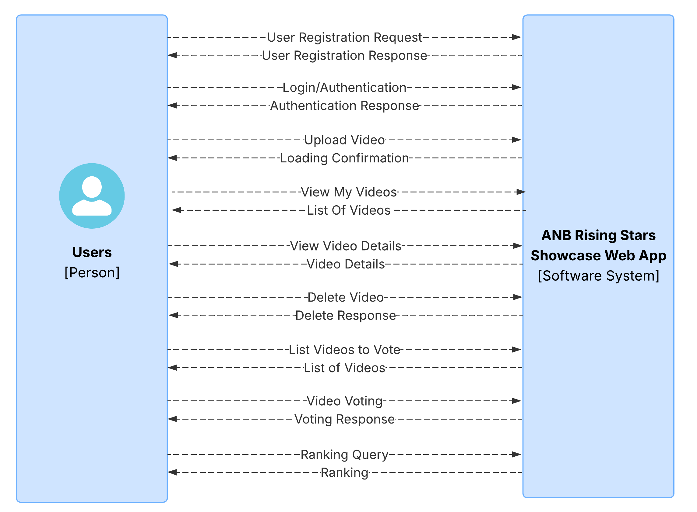
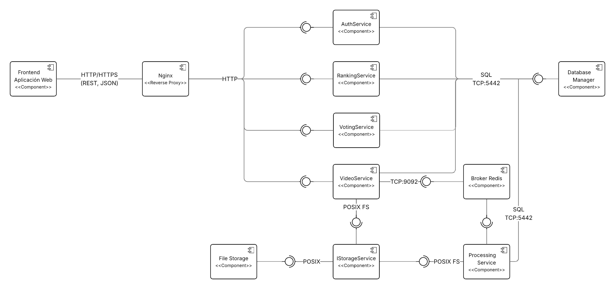
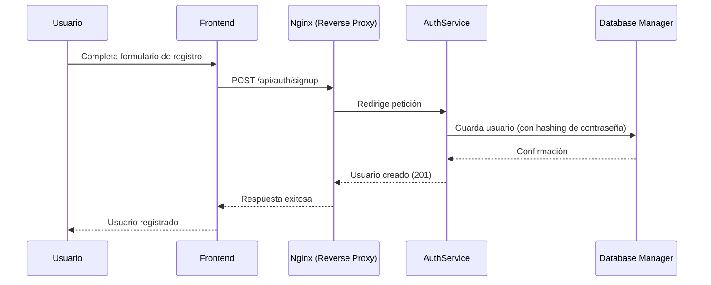
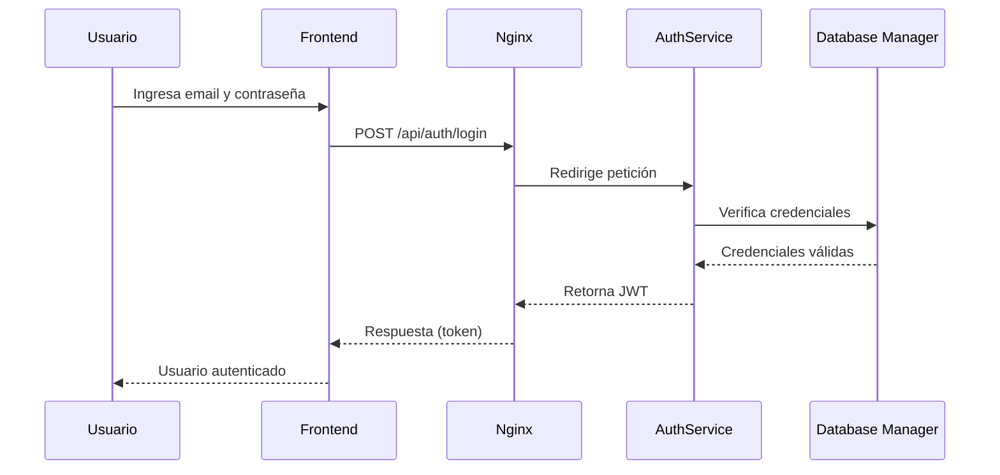
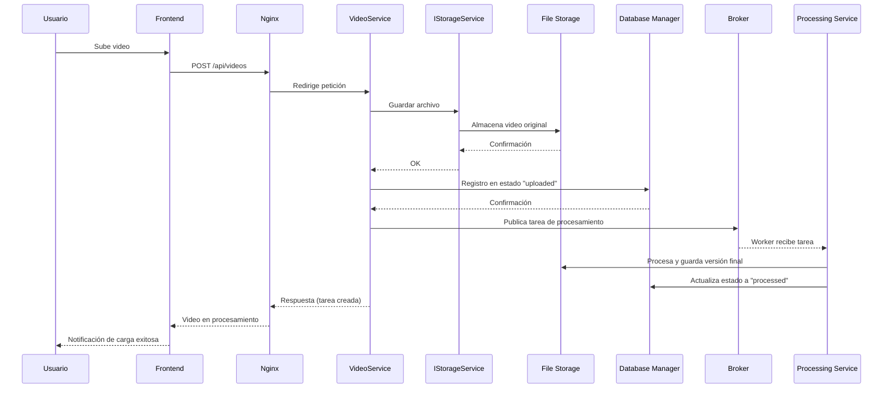
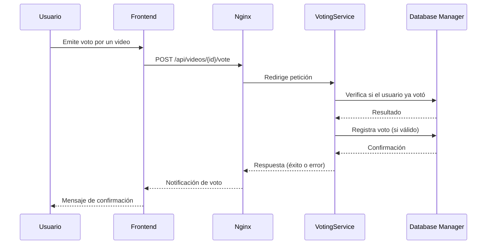
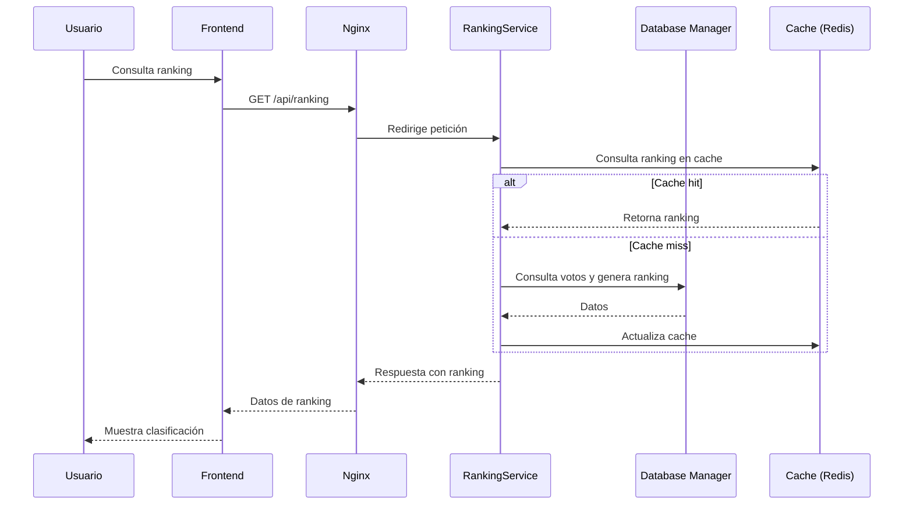
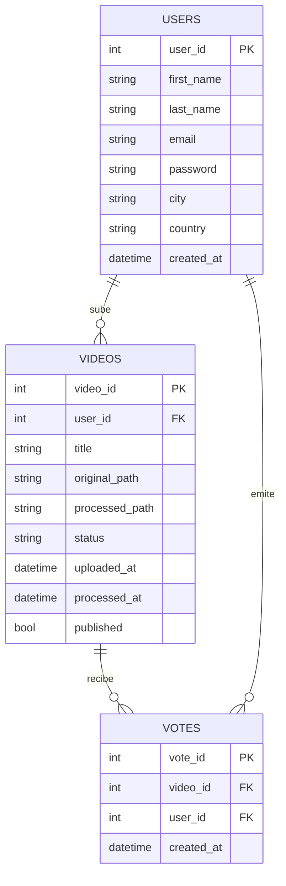

# Entrega 1
A continuación se relacionada el detalle de las funcionalidades de la aplicación, decisiones de arquitectura y consideraciones importantes para el despliegue de la app.

## Características Principales
- Sistema de autenticación y registro de usuarios.
- Sistema para cargue de videos.
- Sistema de procesamiento asíncrono del video para que cumpla con los requerimiento de tamaño, Resolución y duración.
- Sistema de actualización de ranking.
- Interfaz de usaurio moderna y responsiva.
- Arquitectura de microservicios.
- Seguridad en la autenticación mediante token JWT.
- Uso de Docker para empaquetra código de los servicios y componentes para fácil despliegue.
- Uso de GitActions para ejecución de pruebas unitarias, pruebas de integración, construcción de imagenes y análisis estático del código.

## 📌 Arquitectura
Para la defiición de la arquitectura se tuvieron en cuenta múltiples factores de acuerdo a los solicitado en el requerimiento, que terminaron por impactar directamente las decisiones de diseño y definicion de Vistas de arquitectura, los cuales relacionamos a continuación:

### 🎯 Objetivos principales
- Diseñar e implementar una API REST escalable y segura para la gestión de usuarios y recursos.
- Incorporar un sistema de procesamiento asíncrono para ejecución de tareas en segundo plano.
- Garantizar seguridad, disponibilidad y eficiencia en el almacenamiento de archivos.
- Orquestar el despliegue mediante contenedores y CI/CD para portabilidad y resiliencia.
- Documentar la arquitectura con diagramas C4, decisiones de diseño y contratos de la API.
- Implementar un frontend integrado con la API.

### ⚙️ Requisitos funcionales clave

- Gestión de usuarios: registro, autenticación con JWT, control de sesiones y roles.
- Carga y procesamiento de videos:
- Revisión rango de video entre 20 y 60 segundos.
- Relación 16:9.
- Inclusión de marca de agua y cortinillas institucionales.
- Procesamiento asíncrono (workers + broker de mensajería).
- Gestión de estados de archivos: uploaded → processed.
- Votación pública y ranking:
- Un voto por usuario por video.
- Ranking dinámico con caching (Redis o vistas materializadas en PostgreSQL).

### 🔐 Requisitos de seguridad
- Uso de JWT para autenticación/autorización.
- Control de accesos a endpoints críticos.
- Cifrado y hashing de contraseñas.
- Validaciones estrictas en registro y login.

### 📦 Requisitos de infraestructura y despliegue
- Lenguaje backend: Go (Golang).
- Framework: Gin o Echo.
- Base de datos: PostgreSQL.
- Gestión de tareas: Asynq/Machinery con Redis.
- Servidor web: Nginx como proxy inverso.
- Contenedorización: Docker + docker-compose.
- CI/CD: GitHub Actions con pruebas unitarias, construcción automática y validación con SonarQube.

### Vista de contexto
La aplicación interactuará directamente con los usuarios que deseen registrarse en la aplicación para realizar las diferentes funcionalidades disponibles y descritas en el diagrama.

### Vista de Componentes

**Componentes y responsabilidades**:

* **Frontend (HTML/CSS/JavaScript)**

    * Renderiza la UI (formularios de registro y Login, cargue de videos, consulta de videos, consulta de rankings y registro de voto por un vídeo).
    * Genera el llamado a los microservicios vía **HTTP/JSON**.
    * Gestiona el token JWT en el navegador (localStorage o cookies seguras).

* **Auth Service(Go)**
    * **Controllers**: Expone endpoints `/api/auth/signup` (registro), `/api/auth/login` (login).
    * **Utils**: Realiza el hashing de la contraseña (bcrypt), emisión de **JWT**.
    * **Models**: Define los atributos del modelo de usuarios.
    * **Repository**: Se encarga de los procesos de escritura y lectura en la base de datos.
    * **Services**: Define la lógica de negocio para registro y login de los usuarios.
    * Persiste y consulta usuarios en base de datos.

* **Processing Service (Go)**
    * **Controllers**: Encargado de realizar todo el procesamiento del video para que cumpla con los requisitos.

* **Ranking Service (Go)**
    * **Controllers**: Expone endpoint `/api/public/ranking`
    * Se encarga de realizar el proceso de validación continuamente para actualizar el rankig con los usuarios más votados.

* **Video Service (Go)**
    * **Controllers**: Expone endpoints `/api/videos/upload` (Subir video), `/api/videos` (Lista de videos subidos), `/api/videos/:video_id` (Obtiene detalle del video - GET, Elimina un video propio - DELETE) 
    * Toma la información de la cola y es el encar
    * Se encarga de recibir el video cargado y entregarlo a la capa de abstracción para almacenar el archivo y registrar la tarea en la cola.

* **Voting Service (Go)**
    * **Controllers**: Expone endpoint `api/public/videos` (Consulta videos publicos), `/api/public/videos/{video_id}/vote` (Registra un voto)
    * Se encarga de registrar los votos de los usuarios.

+ **Database Manager**
    * Almacena los usuarios, información de videos y votos registrados.
    * Los serviciso acceden mediante consultas parametrizadas (evitando inyección SQL).
    * Utiliza indices para acelerar las búsquedas.

# Documentación — Broker de Tareas y Storage
---

* **Broker**

  **Tecnologías**
  - `Redis`: broker/cola en memoria (rápido, operaciones atómicas).
  - `Asynq` (Go): jobs con colas, reintentos, timeouts, retención de histórico.
  - `asynqmon` (opcional): UI para monitorear colas/tareas.

  **Flujo**
  1. `POST /api/videos/upload` (video-service):
     - Valida **extensión**: solo `.mp4` (case-insensitive, por nombre).
     - Valida **duración**: **20–60s** usando `ffprobe`.
     - Guarda original: `original/u{userID}/{videoID}.mp4`.
     - Inserta en BD: `status = "uploaded"`.
     - **Encola** tarea `video:process` en Redis (cola `videos`) con:
       - `task_id = video_id` (se fuerza con `asynq.TaskID(p.VideoID)`).
       - `MaxRetry(5)`, `Timeout(30m)`, `Retention(24h)`.
  2. `processing-service` (worker):
     - Consume cola `videos` desde Redis.
     - Ejecuta `ffmpeg` (normaliza a 720p, H.264/AAC, **máx 60s**).
     - Guarda procesado: `processed/u{userID}/{videoID}.mp4`.
     - Actualiza BD: `status = "processed"`, `processed_path/processed_at`.
  3. `POST /api/videos/{id}/publish`:
     - Marca `published = true` (y opcional `published_at`).
     - Desde aquí, **DELETE es inválido** (400).
  4. `DELETE /api/videos/{id}`:
     - **Permite** cuando **no está publicado**.
     - Borra archivos (original + processed) y setea `status = "deleted"` (soft delete).

  **Notas de uso**
  - Si se intenta re-encolar con el **mismo** `task_id` mientras exista histórico, Asynq devuelve error por **ID duplicado**.
  - Recomendado exponer asynqmon en `http://localhost:8082` para observar colas, reintentos, latencias.
  - Variables:
    - `REDIS_ADDR=redis:6379`
    - `WORKER_CONCURRENCY=5`

  **Endpoints afectados**
  - `POST /api/videos/upload` → encola procesamiento.
  - `POST /api/videos/{video_id}/publish` → marca como publicado.
  - `DELETE /api/videos/{video_id}` → bloquea si `published = true` (400).

---

* **StorageService**    

  **Responsabilidades**
  - `SaveOriginal(userID, videoID, file)`  
    Guarda el archivo original en una ruta **relativa** y retorna esa ruta.
  - `GetPublicURL(relPath)`  
    Convierte una ruta relativa en URL pública (prefijo `/static/`).
  - `Delete(relPath)`  
    Elimina el archivo si existe (idempotente).

  **Implementación (LocalStorage)**
  - Base configurada por `STORAGE_BASE_PATH` (p. ej. `/data/uploads`).
  - Estructura de archivos:
    - Originales: `original/u{userID}/{videoID}.mp4`
    - Procesados: `processed/u{userID}/{videoID}.mp4`
  - Mapeo a URL pública:
    - `/static/original/u{userID}/{videoID}.mp4`
    - `/static/processed/u{userID}/{videoID}.mp4`
  - Estandarización del nombre:
    - Se **fuerza** el guardado como `{videoID}.mp4` (independiente del nombre original del usuario).
  - Validaciones en upload (previas a persistir en BD):
    - **Formato**: solo `.mp4` por extensión del nombre (minúsculas para comparar).
    - **Duración**: `ffprobe` sobre el archivo guardado; si **<20s** o **>60s**, se borra y se retorna error.

  **Reglas de negocio relacionadas**
  - **Eliminar**: permitido si **no está publicado**. Si `published = true`, retorna **400**.
  - **Publicar**: solo si `status = "processed"` y existe `processed_path`.

  **Variables**
  - `STORAGE_BASE_PATH=/data/uploads`

---

    

* Cada servicio tiene su “capa de controladores” (HTTP) y “lógica” (reglas/validaciones).
* Se comparte una única BD (patrón **DB-shared** entre microservicios); simple en local.
* Contratos REST simples, formato JSON, y autenticación **Bearer JWT**.

**Flujo de trabajo**

1. Registro de usuario (Signup)

2. Login y generación de JWT

3. Carga de vídeo

4. Votación

5. Ranking

## Modelo Entidad - Relación (ERD)

---
📌 Relaciones principales:  
- **Un usuario puede subir muchos videos** (`Users 1 → N Videos`).  
- **Un video puede recibir muchos votos** (`Videos 1 → N Votes`).  
- **Un usuario puede emitir muchos votos** (`Users 1 → N Votes`).  

