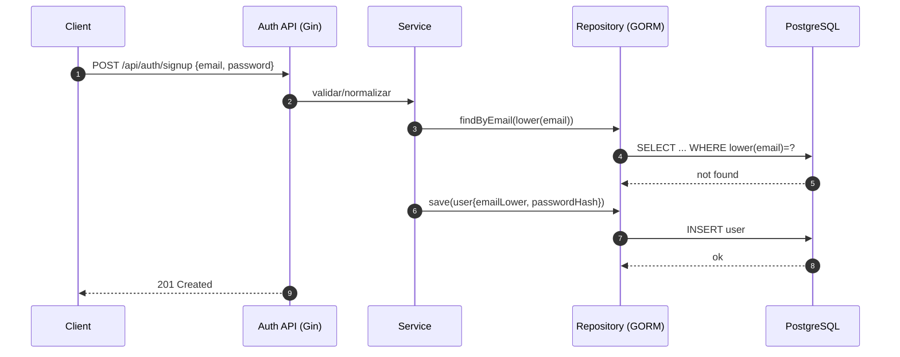
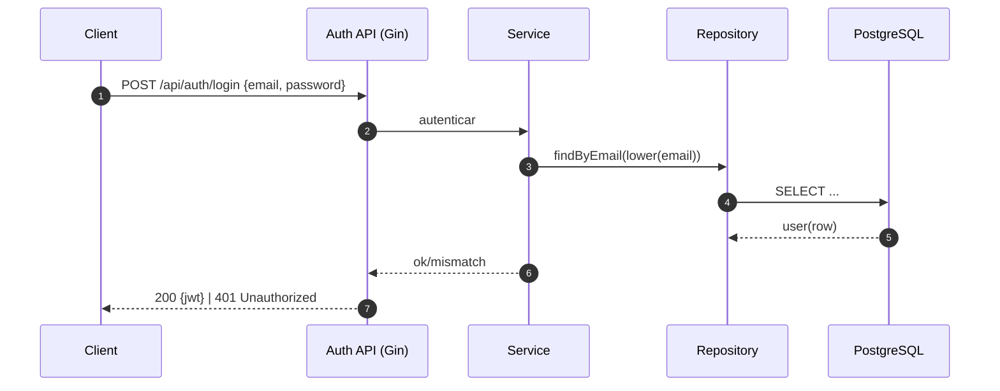

# Entrega 1
A continuación se relacionada el detalle de las funcionalidades de la aplicación, decisiones de arquitectura y consideraciones importantes para el despliegue de la app.

## Características Principales
- Sistema de autenticación y registro de usuarios.
- Sistema para cargue de videos.
- Sistema de procesamiento en batch del video para que cumpla con los requerimiento de tamaño, Resolución y duración.
- Sistema de actualización de ranking.
- Interfaz de usaurio moderna y responsiva.
- Arquitectura de microservicios.
- Seguridad en la autenticación mediante token JWT.
- Uso de Docker para empaquetra código de los servicios y componentes para fácil despliegue.
- Uso de GitActions para ejecución de pruebas unitarias, pruebas de integración, construcción de imagenes y análisis estático del código.

## 📌 Arquitectura
Para la defiición de la arquitectura se tuvieron en cuenta múltiples factores de acuerdo a los solicitado en el requerimiento, que terminaron por impactar directamente las decisiones de diseño y definicion de Vistas de arquitectura, los cuales relacionamos a continuación:

### 🎯 Objetivos principales
- Diseñar e implementar una API REST escalable y segura para la gestión de usuarios y recursos.
- Incorporar un sistema de procesamiento asíncrono para ejecución de tareas en segundo plano.
- Garantizar seguridad, disponibilidad y eficiencia en el almacenamiento de archivos.
- Orquestar el despliegue mediante contenedores y CI/CD para portabilidad y resiliencia.
- Documentar la arquitectura con diagramas C4, decisiones de diseño y contratos de la API.
- Implementar un frontend integrado con la API.

### ⚙️ Requisitos funcionales clave

- Gestión de usuarios: registro, autenticación con JWT, control de sesiones y roles.
- Carga y procesamiento de videos:
- Recorte automático a 30s.
- Ajuste a 720p, relación 16:9.
- Inclusión de marca de agua y cortinillas institucionales.
- Procesamiento asíncrono (workers + broker de mensajería).
- Gestión de estados de archivos: uploaded → processed.
- Votación pública y ranking:
- Un voto por usuario por video.
- Ranking dinámico con caching (Redis o vistas materializadas en PostgreSQL).

### 🔐 Requisitos de seguridad
- Uso de JWT para autenticación/autorización.
- Control de accesos a endpoints críticos.
- Cifrado y hashing de contraseñas.
- Validaciones estrictas en registro y login.

### 📦 Requisitos de infraestructura y despliegue
- Lenguaje backend: Go (Golang).
- Framework: Gin o Echo.
- Base de datos: PostgreSQL.
- Gestión de tareas: Asynq/Machinery con Redis o RabbitMQ.
- Alternativa: Apache Kafka para mayor escalabilidad y tolerancia a fallos.
- Servidor web: Nginx como proxy inverso.
- Contenedorización: Docker + docker-compose.
- CI/CD: GitHub Actions con pruebas unitarias, construcción automática y validación con SonarQube.

### Vista de contexto
La aplicación interactuará directamente con los usuarios que deseen registrarse en la aplicación para realizar las diferentes funcionalidades disponibles y descritas en el diagrama.

### Vista de Componentes

**Componentes y responsabilidades**:

* **Frontend (HTML/CSS/JavaScript)**

    * Renderiza la UI (formularios de registro y Login, cargue de videos, consulta de videos, consulta de rankings y registro de voto por un vídeo).
    * Genera el llamado a los microservicios vía **HTTP/JSON**.
    * Gestiona el token JWT en el navegador (localStorage o cookies seguras).

* **Auth Service(Go)**
    * **Controllers**: Expone endpoints `/api/auth/signup` (registro), `/api/auth/login` (login).
    * **Utils**: Realiza el hashing de la contraseña (bcrypt), emisión de **JWT**.
    * **Models**: Define los atributos del modelo de usuarios.
    * **Repository**: Se encarga de los procesos de escritura y lectura en la base de datos.
    * **Services**: Define la lógica de negocio para registro y login de los usuarios.
    * Persiste y consulta usuarios en base de datos.

* **Processing Service (Go)**
    * **Controllers**: Encargado de realizar todo el procesamiento del video para que cumpla con los requisitos.

* **Ranking Service (Go)**
    * **Controllers**: Expone endpoint `/api/public/ranking`
    * Se encarga de realizar el proceso de validación continuamente para actualizar el rankig con los usuarios más votados.

* **Video Service (Go)**
    * **Controllers**: Expone endpoints `/api/videos/upload` (Subir video), `/api/videos` (Lista de videos subidos), `/api/videos/:video_id` (Obtiene detalle del video - GET, Elimina un video propio - DELETE) 
    * Toma la información de la cola y es el encar
    * Se encarga de recibir el video cargado y entregarlo a la capa de abstracción para almacenar el archivo y registrar la tarea en la cola.

* **Voting Service (Go)**
    * **Controllers**: Expone endpoint `api/public/videos` (Consulta videos publicos), `/api/public/videos/{video_id}/vote` (Registra un voto)
    * Se encarga de registrar los votos de los usuarios.

+ **Database Manager**
    * Almacena los usuarios, información de videos y votos registrados.
    * Los serviciso acceden mediante consultas parametrizadas (evitando inyección SQL).
    * Utiliza indices para acelerar las búsquedas.

* **Broker**
    * 

* **IStorageService**
    +

**Flujo de trabajo**

1. Registro de usuario (Signup)
    1. Cliente envía POST /api/auth/signup con {email, password}.
    2. Router (Gin) → Controller Register.
    3. Service valida formato y normaliza email (lowercase).
    4. Repository (GORM) consulta users por lower(email).
    5. Si existe → 400 (UserAlreadyExists).
    6. Si no existe → hashea contraseña, inserta en PostgreSQL → 201.

2. Login y generación de JWT
    1. Cliente envía POST /api/auth/login con {email, password}.
    2. Router → Controller Login.
    3. Service busca usuario (lower(email)), compara hash.
    4. Si no existe o mismatch → 401.
    5. Si ok → firma JWT con JWT_SECRET y retorna 200 + token.

