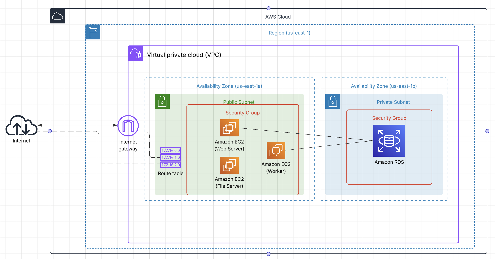

# Reporte de arquitectura desplegada en AWS

## 1. Descripción general

La infraestructura se despliega en el entorno Sandbox de **AWS** dentro de la región `us-east-1`. En su versión actual se organiza dentro de una **VPC (Virtual Private Cloud)** que contiene:

* Una **subred pública** (AZ `us-east-1a`) para las instancias EC2 con conectividad directa a Internet.
* Una **subred privada** (AZ `us-east-1b`) para la base de datos PostgreSQL administrada en Amazon RDS.
* Un **Internet Gateway** asociado a la VPC que permite la salida/entrada desde Internet a los recursos en la subred pública.

El diseño busca aislar los componentes críticos (la base de datos) en una zona privada mientras expone únicamente los servidores necesarios (web, worker y file server). Adicionalmente, para efectos de reproducibilidad, se utiliza Terraform como herramienta para definir la infraestructura como código (ver carpeta `infra/tf`).

---

## 2. Recursos Utilizados

### Red y conectividad

* **VPC**: red virtual en AWS donde residen todos los recursos. Define el rango de direcciones privadas (ejemplo: `172.16.0.0/16`).
* **Subred Pública**: alojada en `us-east-1a`, contiene las instancias EC2 accesibles desde Internet. Está asociada a una tabla de ruteo que envía tráfico externo al **Internet Gateway**.
* **Subred Privada**: alojada en `us-east-1b`, contiene únicamente la instancia de RDS PostgreSQL. No tiene acceso directo a Internet, lo que reduce la superficie de ataque.
* **Internet Gateway**: punto de entrada/salida de la VPC que conecta los recursos de la subred pública con Internet.
* **Route Table**: tabla de enrutamiento que asegura que la subred pública tenga salida a Internet a través del Internet Gateway.

### Seguridad

* **Security Group EC2**: permite acceso SSH (22) desde IPs autorizadas, HTTP (80) desde cualquier origen y comunicación interna entre servidores.
* **Security Group RDS**: restringe el acceso al puerto 5432 (PostgreSQL) únicamente desde el Security Group de las instancias EC2. Esto significa que la base de datos no es accesible directamente desde Internet.

### Cómputo

* **Amazon EC2 Web Server**: instancia que ejecuta el servidor web, expuesto en el puerto 80 para servir la aplicación a los clientes.
* **Amazon EC2 Worker**: instancia destinada al procesamiento asíncrono (ej. colas de tareas, procesamiento en segundo plano).
* **Amazon EC2 File Server**: instancia configurada como servidor NFS para compartir almacenamiento con otras EC2 (se utiliza en lugar de EFS para cumplir con restricciones de la entrega).

### Almacenamiento y Base de Datos

* **Amazon RDS (PostgreSQL)**: base de datos relacional gestionada por AWS. Se encuentra en una subred privada, con backup y seguridad gestionados. Solo accesible desde las instancias de la subred pública (EC2s) a través del Security Group compartido.

---

## 3. Estructura de la Arquitectura

La arquitectura se organiza en capas:

1. **Capa de Presentación (Frontend)**

   * Representada por la instancia EC2 **Web Server**, expuesta al público en el puerto 80.
   * Atiende peticiones HTTP de los usuarios a través de Internet.

2. **Capa de Aplicación (Lógica y Procesamiento)**

   * Implementada en dos servidores:

     * **Worker**: maneja procesos en background, colas de tareas o procesamiento intensivo.
     * **File Server**: provee almacenamiento compartido mediante NFS, accesible desde Web y Worker.

3. **Capa de Datos (Persistencia)**

   * **RDS PostgreSQL** en subred privada, aislada de accesos externos.
   * Solo accesible desde la capa de aplicación mediante reglas de seguridad.

---

## 4. Flujo de Ejecución de la Aplicación

1. **Usuario → Internet → Web Server**
   El cliente realiza una petición HTTP al **Web Server** (EC2 en subred pública).

2. **Web Server → Worker / File Server**

   * Si la solicitud requiere tareas en segundo plano, el Web Server se comunica con el **Worker** para delegar la ejecución.
   * Si la aplicación necesita acceder a archivos compartidos (subidas, contenido multimedia, logs), lo hace a través del **File Server** (NFS).

3. **Web Server / Worker → RDS PostgreSQL**

   * Para consultas o almacenamiento de información persistente, las instancias EC2 se conectan a la base de datos en la subred privada.
   * La conexión está protegida, ya que el Security Group del RDS solo permite tráfico desde los Security Groups de las EC2.

4. **RDS → Respuesta → Web Server → Usuario**

   * La base de datos responde a la solicitud, el Web Server procesa la información y envía la respuesta final al usuario a través de Internet.

---

## 5. Beneficios de la Arquitectura

* **Seguridad reforzada**: RDS en subred privada no es accesible desde Internet.
* **Escalabilidad**: la separación de roles (Web, Worker, File Server) permite la posibilidad de escalar cada capa de forma independiente.
* **Separación de responsabilidades**: infraestructura organizada en capas claras (frontend, lógica, datos).
* **Cumplimiento con buenas prácticas de AWS**: aislamiento de datos sensibles y exposición mínima de servicios públicos.