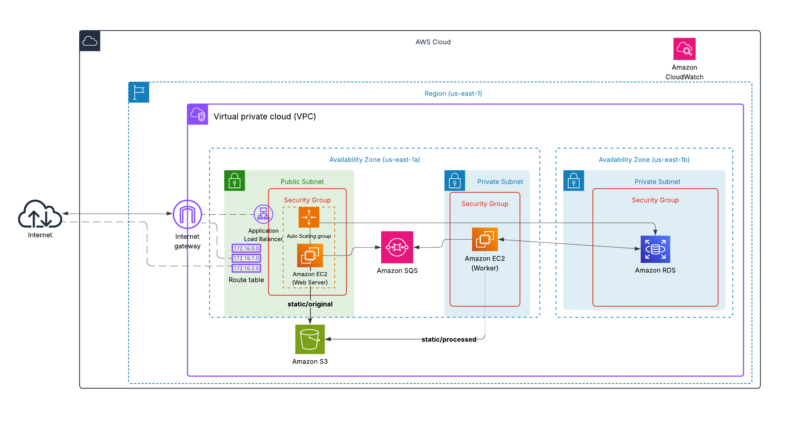

# Reporte de arquitectura desplegada en AWS – Entrega 3

## 1. Descripción general

La infraestructura definida en esta entrga implementa una arquitectura cloud moderna y segura sobre la cuenta sandbox de AWS, orientada a soportar una aplicación web compuesta por múltiples servicios (web, procesamiento, base de datos, almacenamiento, etc). Se utilizan recursos gestionados y buenas prácticas de segmentación, alta disponibilidad y seguridad, facilitando el despliegue, operación y escalabilidad de la solución.



## 2. Recursos utilizados

### 2.1. Red y conectividad

- **VPC dedicada**: Se crea una Virtual Private Cloud (VPC) con un bloque CIDR configurable (`10.0.0.0/16` por defecto), habilitando DNS interno.
- **Subredes públicas y privadas**: 
  - Dos subredes públicas (en distintas zonas de disponibilidad) para exponer servicios web y balanceadores.
  - Dos subredes privadas (en distintas zonas de disponibilidad) para recursos internos como la base de datos y almacenamiento.
- **Internet Gateway**: Permite la salida a Internet de las instancias en subredes públicas.
- **Tablas de rutas**: Configuración de rutas para acceso a Internet desde subredes públicas.
- **VPC Endpoints**: Se crean endpoints privados para servicios críticos de AWS (SSM, KMS), permitiendo la administración y cifrado sin exponer tráfico a Internet.

### 2.2. Seguridad

- **Grupos de seguridad**: 
  - Reglas estrictas para acceso HTTP/HTTPS desde Internet solo a los servicios web.
  - Acceso SSH restringido únicamente a una IP administrativa.
  - Comunicación interna entre servicios controlada por reglas de grupo de seguridad.
- **Roles e Instance Profiles**: Uso de roles gestionados para acceso seguro a recursos AWS desde las instancias EC2.

### 2.3. Cómputo

- **EC2 Launch Template y Auto Scaling Group**: 
  - Plantilla de lanzamiento para instancias web basada en Amazon Linux 2023.
  - Configuración de escalabilidad automática (ASG) para alta disponibilidad (deseado=2, mínimo=2, máximo=3).
  - Instalación automatizada de Docker y docker-compose para orquestar los servicios de la aplicación.
  - Health checks configurados vía ELB con grace period de 900 segundos.
  - **Políticas de escalado automático**:
    - Target Tracking basado en CPU (objetivo: 70% de utilización).
    - Target Tracking basado en request count por target (objetivo: 1000 requests).
- **Instancia Worker (EC2 privada)**: 
  - Instancia dedicada en subred privada para procesamiento asíncrono de videos.
  - Consume mensajes de SQS para procesar videos.
  - Tipo de instancia: t3.small (2 vCPU, 2 GiB RAM).
  - Sin IP pública, acceso a Internet vía NAT Gateway.
  - Acceso administrativo vía AWS Systems Manager (SSM).

### 2.4. Almacenamiento y Base de Datos

- **Amazon S3**: 
  - Un bucket unificado para almacenamiento de videos (originales y procesados).
  - Configuración de lifecycle policy para limpiar cargas incompletas después de 7 días.
  - Bloqueo de acceso público habilitado.
  - Acceso vía roles de IAM desde instancias EC2.
- **Amazon RDS (PostgreSQL)**: 
  - Instancia de base de datos PostgreSQL 16.9 en subredes privadas, no expuesta a Internet.
  - Tipo de instancia: db.t3.micro.
  - Almacenamiento: 20 GB (gp3).
  - Grupo de parámetros personalizado para logging y performance.
  - Subnet group para alta disponibilidad (aunque en modo dev, sin Multi-AZ).
  - **Inicialización automática**: El script `init.sql` se ejecuta automáticamente al desplegar las instancias web para poblar la base de datos con datos iniciales.

### 2.5. Mensajería y Procesamiento Asíncrono

- **Amazon SQS (Simple Queue Service)**:
  - **Cola principal** (`anbapp-video-processing`): 
    - Recibe mensajes con información de videos a procesar.
    - Visibility timeout: 1800 segundos (30 minutos).
    - Long polling habilitado (10 segundos).
    - Retención de mensajes: 14 días.
  - **Dead Letter Queue (DLQ)** (`anbapp-video-processing-dlq`): 
    - Recibe mensajes que fallaron después de 3 intentos (maxReceiveCount=3).
    - Permite análisis de mensajes problemáticos sin perder información.
    - Retención: 14 días.

### 2.6. Caché y Sesiones

- **Redis**: 
  - Contenedor Docker desplegado en instancias web.
  - Puerto: 6379.
  - Persistencia habilitada (AOF + snapshots cada 60 segundos con 1000 cambios).
  - Volumen persistente para datos.
  - Usado para caché de sesiones y datos frecuentes.

### 2.7. Servicios de Aplicación

La aplicación se compone de microservicios independientes desplegados como contenedores Docker:

**En instancias Web (Auto Scaling Group):**
- **Auth Service** (puerto 8080): Autenticación y autorización de usuarios.
- **Video Service** (puerto 8081): Gestión de carga y consulta de videos.
- **Voting Service** (puerto 8082): Sistema de votaciones.
- **Ranking Service** (puerto 8083): Cálculo y consulta de rankings.
- **Frontend** (puerto 8084): Interfaz de usuario.
- **Redis** (puerto 6379): Caché y gestión de sesiones.

**En instancia Worker (privada):**
- **Processing Service**: Procesamiento asíncrono de videos (redimensionamiento, marca de agua, validaciones).

## 3. Estructura de la Arquitectura

La arquitectura se organiza en capas y zonas de disponibilidad para maximizar la seguridad y disponibilidad:

- **Capa pública**: 
  - Balanceador de carga (ALB) y servicios web expuestos a Internet.
  - Acceso restringido por grupos de seguridad.
- **Capa privada**: 
  - Servicios de backend, procesamiento, base de datos y almacenamiento.
  - Comunicación interna segura, sin exposición directa a Internet.
- **Almacenamiento**: 
  - Buckets S3 para archivos y almacenamiento compartido entre instancias.
- **Administración y monitoreo**: 
  - VPC Endpoints para administración segura vía SSM/KMS.
  - Roles y políticas para acceso controlado a recursos.

## 4. Flujo de ejecución de la aplicación

1. **Despliegue de infraestructura**: Terraform crea la VPC, subredes, instancias, buckets, RDS, SQS y configura la seguridad.
2. **Inicialización de instancias**: 
   - Las instancias EC2 se configuran automáticamente (user-data) para instalar Docker y docker-compose.
   - Se clona el repositorio de la aplicación desde GitHub.
   - Se despliegan los servicios automáticamente.
   - **Inicialización de BD**: El script `init.sql` se ejecuta automáticamente para poblar la base de datos.
3. **Carga de videos**: 
   - El usuario accede a la aplicación vía ALB.
   - El ALB distribuye el tráfico según path-based routing a los diferentes servicios.
   - El usuario sube un video a través del Frontend.
   - El Video Service guarda el video en S3 y envía un mensaje a SQS con los detalles.
4. **Procesamiento asíncrono**: 
   - El Processing Service (en instancia Worker) consume mensajes de SQS.
   - Descarga el video de S3, lo procesa (validaciones, redimensionamiento, marca de agua).
   - Guarda el video procesado en S3.
   - Actualiza el estado en la base de datos.
   - Si falla 3 veces, el mensaje va a la DLQ.
5. **Votación y ranking**: 
   - Los usuarios votan por videos a través del Voting Service.
   - El Ranking Service calcula rankings dinámicos.
   - Redis cachea resultados frecuentes para mejorar performance.
6. **Escalado automático**: 
   - CloudWatch monitorea métricas de CPU y request count.
   - Auto Scaling ajusta el número de instancias web (2-3) según la carga.
7. **Acceso y administración**: 
   - El acceso a la aplicación se realiza a través del ALB en la capa pública.
   - La administración de instancias se realiza de forma segura mediante SSM (VPC Endpoints), sin necesidad de exponer puertos de administración.

## 5. Mejoras respecto a la Entrega 2

### 5.1. Alta Disponibilidad y Escalabilidad

- **Auto Scaling Group**: Reemplaza la instancia web única por un grupo de instancias que escala automáticamente (2-3 instancias).
- **Application Load Balancer**: Distribuye tráfico entre múltiples instancias con health checks.
- **Multi-AZ**: Subnets en dos zonas de disponibilidad para redundancia.
- **Políticas de escalado automático**: Ajuste dinámico basado en métricas de CPU y request count.

### 5.2. Procesamiento Asíncrono

- **Amazon SQS**: Desacopla la carga de videos del procesamiento.
- **Dead Letter Queue**: Maneja mensajes fallidos sin perder información.
- **Worker dedicado**: Instancia privada exclusiva para procesamiento pesado.

### 5.3. Almacenamiento y Caché

- **S3 en lugar de NFS**: Mayor durabilidad, escalabilidad ilimitada y menor costo.
- **Redis**: Caché de sesiones y datos frecuentes para mejorar performance.
- **Lifecycle policies**: Limpieza automática de cargas incompletas.

### 5.4. Seguridad y Administración

- **VPC Endpoints**: Administración segura vía SSM sin exponer instancias privadas.
- **Path-based routing**: Separación de tráfico por servicio en el ALB.
- **Grupos de seguridad específicos**: Reglas granulares para cada componente.
- **SSM Parameter Store**: Almacenamiento seguro de configuraciones (passwords como SecureString).

### 5.5. Despliegue Automatizado

- **User-data scripts**: Instalación y despliegue completamente automatizado.
- **Inicialización de BD**: Población automática de datos iniciales.
- **Scripts de gestión**: Scripts generados automáticamente para restart, logs, etc.

## 6. Consideraciones de Costos

### Recursos Principales y Costos Estimados (us-east-1):

- **EC2 Web (Auto Scaling)**: 2 x t3.small (~$0.0208/hora) = ~$0.0416/hora (~$30/mes)
- **EC2 Worker**: 1 x t3.small (~$0.0208/hora) = ~$15/mes
- **RDS PostgreSQL**: db.t3.micro (~$0.017/hora) = ~$12/mes
- **Application Load Balancer**: ~$0.0225/hora + data processed = ~$16/mes
- **NAT Gateway**: ~$0.045/hora + data transfer = ~$32/mes
- **S3**: Almacenamiento + requests (variable según uso)
- **SQS**: Primeros 1M requests gratis, luego $0.40/millón
- **VPC Endpoints**: ~$0.01/hora por endpoint x 4 = ~$29/mes

**Costo mensual estimado**: ~$134-150/mes (sin contar tráfico de red)

### Recomendaciones para Optimizar Costos:

1. **Detener instancias fuera de horario de pruebas**: Usar AWS Instance Scheduler.
2. **Eliminar RDS cuando no se use**: Tomar snapshot antes de eliminar.
3. **Reducir ASG a 1 instancia** en períodos de baja carga.
4. **Eliminar NAT Gateway**: Si no se necesita acceso a Internet desde instancias privadas.
5. **Usar VPC Endpoints Gateway para S3**: Sin costo adicional.
6. **Eliminar VPC Endpoints Interface**: Si SSM no es crítico (usar bastion host).

## 7. Comandos para Desplegar la Arquitectura

### Prerequisitos:

- AWS Academy Learner Lab activo
- Terraform instalado (versión 1.0+)
- Git bash o terminal con soporte bash

### Paso 1: Preparar credenciales de AWS

Navega al directorio de Terraform:

```bash
cd infra/terraform/
```

Obtén las credenciales de AWS Academy (Learner Lab → AWS Details → AWS CLI: Show):

- `aws_access_key_id`
- `aws_secret_access_key`
- `aws_session_token`

Ejecuta el script de configuración:

**En Linux/Mac:**
```bash
./1-set-credentials.sh
```

**En Windows (PowerShell):**
```powershell
.\1-set-credentials.ps1
```

El script te pedirá las credenciales y las guardará en variables de entorno.

### Paso 2: Inicializar Terraform

```bash
terraform init
```

### Paso 3: Planificar el despliegue

Visualiza lo que Terraform va a crear:

**En Linux/Mac:**
```bash
./2-plan.sh
```

**En Windows (PowerShell):**
```powershell
.\2-plan.ps1
```

### Paso 4: Aplicar el despliegue

Despliega la infraestructura:

**En Linux/Mac:**
```bash
./3-apply.sh
```

**En Windows (PowerShell):**
```powershell
.\3-apply.ps1
```

El proceso toma aproximadamente **15-20 minutos**. Al finalizar, verás outputs con:
- URL del ALB para acceder a la aplicación
- Endpoint de RDS
- URL de la cola SQS
- IDs de recursos creados

### Paso 5: Verificar el despliegue

Accede a la aplicación usando el ALB DNS name mostrado en los outputs:

```
http://<alb-dns-name>
```

Puedes verificar el estado de los servicios conectándote a las instancias vía SSM:

1. Ve a AWS Console → EC2 → Instances
2. Selecciona una instancia web
3. Click en "Connect" → "Session Manager" → "Connect"
4. Verifica servicios: `docker ps`

### Paso 6: Destruir la infraestructura

**IMPORTANTE**: Para evitar consumir créditos de AWS Academy, elimina todos los recursos cuando termines:

**En Linux/Mac:**
```bash
./4-destroy.sh
```

**En Windows (PowerShell):**
```powershell
.\4-destroy.ps1
```

**Nota**: La eliminación toma ~10 minutos. Verifica en la consola de AWS que todos los recursos se eliminaron correctamente.

## 8. Monitoreo y Troubleshooting

### Ver logs de servicios

Conéctate a una instancia web vía SSM:

```bash
# Ver servicios activos
docker ps

# Ver logs de todos los servicios
cd /opt/anbapp/repo/infra
docker-compose -f docker-compose.web.yml logs -f

# Ver logs de un servicio específico
docker logs -f auth-service
```

### Verificar la cola SQS

En AWS Console → SQS:
- Revisa el número de mensajes disponibles
- Revisa el número de mensajes en la DLQ
- Purga la cola si es necesario

### Reiniciar servicios

```bash
sudo /opt/anbapp/deploy.sh
```

### Verificar conectividad a RDS

```bash
psql -h <rds-endpoint> -U anbuser -d anbapp
```

### Métricas de Auto Scaling

En AWS Console → EC2 → Auto Scaling Groups:
- Verifica el número de instancias activas
- Revisa métricas de CPU y request count
- Revisa histórico de escalado

## 9. Pruebas de Carga y Validación

Para validar el funcionamiento del Auto Scaling:

1. **Ejecutar pruebas de carga** usando la herramienta de Apache JMeter
2. **Monitorear CloudWatch** para ver métricas de CPU y RAM
3. **Verificar escalado automático** en la consola de Auto Scaling
4. **Validar distribución de tráfico** en el ALB

Revisar el documento de pruebas de carga en: `capacity-planning/Entrega_3/`

## 10. Conclusiones

La arquitectura de la Entrega 3 representa una evolución significativa respecto a la Entrega 2:

- **Escalabilidad**: Auto Scaling Group permite manejar cargas variables automáticamente
- **Alta disponibilidad**: Multi-AZ y múltiples instancias eliminan puntos únicos de falla
- **Desacoplamiento**: SQS permite procesamiento asíncrono eficiente
- **Performance**: Redis mejora tiempos de respuesta en consultas frecuentes
- **Seguridad**: VPC Endpoints y administración vía SSM sin exposición pública
- **Costo-eficiencia**: Escalado bajo demanda optimiza uso de recursos
- **Mantenibilidad**: Despliegue automatizado facilita actualizaciones

La solución está lista para producción con ajustes menores como habilitar Multi-AZ en RDS, implementar HTTPS en el ALB, y configurar backups automatizados.