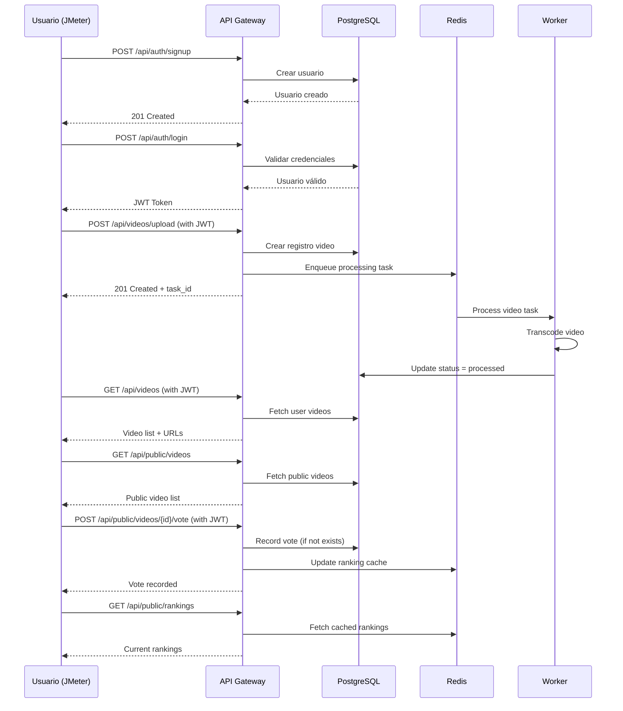
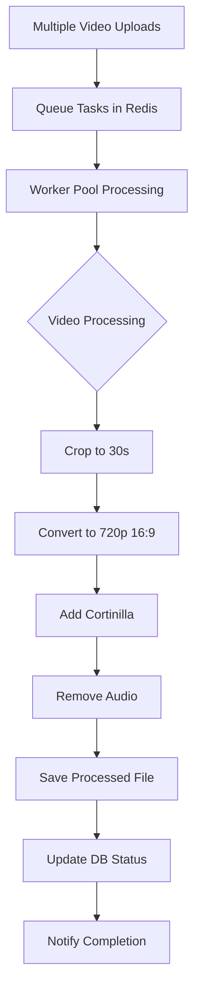

# Plan de Pruebas de Carga - ANB Rising Stars Showcase

**Proyecto:** ANB Rising Stars Showcase - Plataforma de Videos de Demostración  
**Fecha:** 9 de Septiembre, 2025  
**Version:** 1.0  

---

## 1. Objetivos del Plan de Pruebas

### 1.1 Objetivo General
Evaluar la capacidad máxima de la aplicación ANB Rising Stars Showcase y su infraestructura subyacente bajo diferentes cargas de trabajo, identificando puntos de saturación y optimizando el rendimiento del sistema para garantizar una experiencia de usuario óptima.

### 1.2 Objetivos Específicos
- Determinar la capacidad máxima de usuarios concurrentes que puede soportar el sistema
- Evaluar el rendimiento de los endpoints críticos de la API REST
- Verificar la eficiencia del sistema de tareas asíncronas para el procesamiento de videos
- Identificar cuellos de botella en la arquitectura (base de datos, workers, almacenamiento)
- Validar la escalabilidad del sistema de votación en tiempo real
- Establecer métricas de referencia para el monitoreo en producción

---

## 2. Herramienta de Testing Seleccionada

### 2.1 Herramienta Principal: Apache JMeter
**Justificación:**
- **Versatilidad:** Soporte completo para APIs REST, autenticación JWT, y carga de archivos
- **Interfaz gráfica:** Facilita la creación y modificación de planes de prueba complejos
- **Reportes integrados:** Genera automáticamente gráficos y métricas detalladas
- **Extensibilidad:** Amplia gama de plugins para diferentes protocolos y métricas
- **Escalabilidad:** Capacidad para pruebas distribuidas con múltiples generadores de carga
- **Integración CI/CD:** Compatible con pipelines de integración continua

### 2.2 Herramientas Complementarias
- **Apache Bench (ab):** Para pruebas rápidas y smoke tests
- **Postman/Newman:** Para validación funcional previa a las pruebas de carga
- **Grafana + InfluxDB:** Para visualización en tiempo real de métricas
- **Docker Stats:** Para monitoreo de contenedores

---

## 3. Descripción del Entorno de Pruebas

### 3.1 Arquitectura del Sistema Bajo Prueba

```
┌─────────────────┐    ┌─────────────────┐    ┌─────────────────┐
│   Load Balancer │    │   Web Frontend  │    │   API Gateway   │
│     (Nginx)     │───▶│                 │───▶│     (Go)        │
└─────────────────┘    └─────────────────┘    └─────────────────┘
                                                        │
                       ┌─────────────────┐             │
                       │   Video Worker  │◀────────────┘
                       │    (Asynq)      │
                       └─────────────────┘
                                │
        ┌─────────────────┐     │     ┌─────────────────┐
        │   PostgreSQL    │◀────┼────▶│     Redis       │
        │   Database      │     │     │   (Broker)      │
        └─────────────────┘     │     └─────────────────┘
                                │
                       ┌─────────────────┐
                       │ File Storage    │
                       │ (Local/S3)      │
                       └─────────────────┘
```

### 3.2 Especificaciones del Entorno de Pruebas

#### 3.2.1 Servidor de Aplicación (Target)
- **OS:** Ubuntu Server 24.04 LTS
- **CPU:** 4 vCPUs
- **RAM:** 8 GB
- **Almacenamiento:** 100 GB SSD
- **Red:** 1 Gbps

#### 3.2.2 Generador de Carga (Load Generator)
- **Instancia:** AWS EC2 m5.xlarge
- **CPU:** 4 vCPUs (Intel Xeon Platinum 8175M)
- **RAM:** 16 GB
- **Justificación:** Capacidad para simular hasta 1000 usuarios concurrentes con JMeter sin saturar el generador

#### 3.2.3 Stack Tecnológico
- **Backend:** Go (Gin Framework)
- **Base de Datos:** PostgreSQL 15
- **Broker de Mensajes:** Redis (Asynq)
- **Proxy Reverso:** Nginx
- **Contenedores:** Docker + Docker Compose
- **Monitoreo:** Grafana + InfluxDB + Prometheus

---

## 4. Criterios de Aceptación y SLOs

### 4.1 Service Level Objectives (SLOs)

| Métrica | Objetivo | Crítico |
|---------|----------|---------|
| **Tiempo de Respuesta API** | < 500ms (promedio) | < 1000ms (P95) |
| **Throughput Mínimo** | 200 transacciones/minuto | 100 transacciones/minuto |
| **Disponibilidad** | 99.5% | 99.0% |
| **Error Rate** | < 1% | < 5% |
| **Tiempo de Procesamiento de Video** | < 60 segundos | < 120 segundos |
| **Utilización CPU** | < 80% (promedio) | < 95% (pico) |
| **Utilización RAM** | < 85% | < 95% |
| **Capacidad de Usuarios Concurrentes** | 500 usuarios | 250 usuarios (mínimo) |

### 4.2 Criterios Específicos por Funcionalidad

#### 4.2.1 Autenticación (JWT)
- Login exitoso: < 200ms
- Validación de token: < 50ms
- Rate limit: 100 requests/minuto por IP

#### 4.2.2 Upload de Videos
- Respuesta inmediata tras enqueue: < 1 segundo
- Tamaño máximo: 100MB
- Formatos soportados: MP4
- Queue processing latency: < 5 segundos

#### 4.2.3 Sistema de Votación
- Registro de voto: < 300ms
- Actualización de ranking: < 2 segundos
- Prevención de doble voto: 100% efectividad

---

## 5. Escenarios de Prueba

### 5.1 Escenario 1: Flujo Completo de Usuario (Ruta Crítica Web)

**Descripción:** Simula el journey completo de un usuario desde registro hasta votación

**Secuencia de Acciones:**
1. Registro de usuario (`POST /api/auth/signup`)
2. Login y obtención de JWT (`POST /api/auth/login`)
3. Consulta de perfil (`GET /api/videos`)
4. Upload de video (`POST /api/videos/upload`)
5. Consulta de estado del video (`GET /api/videos/{id}`)
6. Navegación a videos públicos (`GET /api/public/videos`)
7. Votación por un video (`POST /api/public/videos/{id}/vote`)
8. Consulta de ranking (`GET /api/public/rankings`)

**Datos de Prueba:**
- 1000 usuarios únicos simulados
- 500 videos de prueba (25MB promedio cada uno)
- Distribución geográfica: 50% Bogotá, 30% Medellín, 20% otras ciudades

**Variabilidad:**
- Think time: 2-5 segundos entre requests
- Tasa de upload: 30% de usuarios suben video
- Tasa de votación: 80% de usuarios votan

### 5.2 Escenario 2: Procesamiento Intensivo de Videos (Ruta Crítica Batch)

**Descripción:** Evalúa la capacidad del sistema de workers para procesar videos en paralelo

**Características:**
- Múltiples uploads simultáneos
- Videos de diferentes tamaños (10MB - 100MB)
- Procesamiento que incluye:
  - Recorte a 30 segundos
  - Conversión a 720p 16:9
  - Adición de cortinilla (5 segundos)
  - Eliminación de audio
  - Generación de thumbnail

**Métricas Específicas:**
- Throughput de procesamiento: videos/minuto
- Tiempo de cola (queue time)
- Tiempo de procesamiento por video
- Tasa de errores en procesamiento
- Utilización de recursos durante batch processing

### 5.3 Escenario 3: Estrés del Sistema de Votación

**Descripción:** Simula votación masiva simultánea (evento viral)

**Características:**
- 1000+ usuarios votando simultáneamente
- Foco en el mismo conjunto de videos populares
- Validación de integridad (1 voto por usuario por video)
- Actualización en tiempo real del ranking

---

## 6. Configuración de Pruebas y Estrategia de Ejecución

### 6.1 Fases de Testing

#### 6.1.1 Smoke Test
**Objetivo:** Verificar funcionamiento básico bajo carga mínima
- **Usuarios:** 10 concurrentes
- **Duración:** 5 minutos
- **Propósito:** Validar que todos los endpoints respondan correctamente

#### 6.1.2 Load Test (Carga Progressive)
**Objetivo:** Determinar el comportamiento bajo carga normal esperada
- **Ramp-up:** 10 → 50 → 100 → 250 → 500 usuarios
- **Incremento:** 50 usuarios cada 2 minutos
- **Duración por nivel:** 10 minutos
- **Duración total:** 60 minutos

#### 6.1.3 Stress Test
**Objetivo:** Encontrar el punto de ruptura del sistema
- **Usuarios:** 500 → 750 → 1000 → 1500 usuarios
- **Incremento:** 250 usuarios cada 5 minutos
- **Criterio de parada:** Error rate > 5% o timeout > 2000ms

#### 6.1.4 Spike Test
**Objetivo:** Evaluar comportamiento ante picos súbitos de tráfico
- **Patrón:** 100 usuarios → 800 usuarios (en 30 segundos) → 100 usuarios
- **Duración:** 15 minutos
- **Repeticiones:** 3 spikes

### 6.2 Configuración de JMeter

```xml
<?xml version="1.0" encoding="UTF-8"?>
<jmeterTestPlan version="1.2">
  <!-- Configuración de Thread Groups -->
  <ThreadGroup>
    <stringProp name="ThreadGroup.num_threads">500</stringProp>
    <stringProp name="ThreadGroup.ramp_time">600</stringProp>
    <stringProp name="ThreadGroup.duration">3600</stringProp>
  </ThreadGroup>
  
  <!-- HTTP Request Defaults -->
  <ConfigTestElement>
    <stringProp name="HTTPSampler.domain">${__P(server.host,localhost)}</stringProp>
    <stringProp name="HTTPSampler.port">${__P(server.port,8080)}</stringProp>
    <stringProp name="HTTPSampler.protocol">http</stringProp>
  </ConfigTestElement>
</jmeterTestPlan>
```

---

## 7. Monitoreo y Métricas

### 7.1 Métricas de Aplicación

#### 7.1.1 Métricas de Rendimiento
- **Response Time:** Promedio, mediana, P90, P95, P99
- **Throughput:** Requests/segundo, transacciones/minuto
- **Error Rate:** Porcentaje de errores por endpoint
- **Concurrent Users:** Usuarios activos simultáneos

#### 7.1.2 Métricas de Negocio
- **Video Upload Success Rate:** Porcentaje de uploads exitosos
- **Video Processing Time:** Tiempo promedio de procesamiento
- **Vote Integrity:** Validación de votos únicos
- **Ranking Update Frequency:** Frecuencia de actualización del ranking

### 7.2 Métricas de Infraestructura

#### 7.2.1 Servidor de Aplicación
- **CPU Utilization:** Porcentaje promedio y picos
- **Memory Usage:** RAM utilizada, swap usage
- **Disk I/O:** IOPS, throughput de lectura/escritura
- **Network:** Bandwidth utilizado, paquetes/segundo

#### 7.2.2 Base de Datos (PostgreSQL)
- **Connection Pool:** Conexiones activas/idle
- **Query Performance:** Tiempo promedio por query
- **Lock Contention:** Bloqueos y deadlocks
- **Cache Hit Ratio:** Efectividad del cache

### 7.3 Stack de Monitoreo

```yaml
# docker-compose.monitoring.yml
version: '3.8'
services:
  prometheus:
    image: prom/prometheus:latest
    ports:
      - "9090:9090"
    volumes:
      - ./prometheus.yml:/etc/prometheus/prometheus.yml

  grafana:
    image: grafana/grafana:latest
    ports:
      - "3000:3000"
    environment:
      - GF_SECURITY_ADMIN_PASSWORD=admin
    volumes:
      - grafana-storage:/var/lib/grafana

  influxdb:
    image: influxdb:1.8
    ports:
      - "8086:8086"
    environment:
      - INFLUXDB_DB=jmeter
```

---

## 8. Topología de Pruebas

### 8.1 Diagrama de Red

```
┌─────────────────────────────────────────────────────────────┐
│                    LOAD TESTING ENVIRONMENT                  │
├─────────────────────────────────────────────────────────────┤
│                                                             │
│  ┌─────────────────┐                ┌─────────────────┐    │
│  │ JMeter Master   │                │ JMeter Slaves   │    │
│  │ (Controller)    │───────────────▶│ (Load Gen)      │    │
│  │ m5.large        │                │ m5.xlarge x2    │    │
│  └─────────────────┘                └─────────────────┘    │
│           │                                  │              │
└───────────┼──────────────────────────────────┼──────────────┘
            │                                  │
            │          INTERNET               │
            │                                  │
┌───────────▼──────────────────────────────────▼──────────────┐
│                 TARGET ENVIRONMENT                          │
├─────────────────────────────────────────────────────────────┤
│                                                             │
│  ┌─────────────────┐    ┌─────────────────┐                │
│  │     Nginx       │    │  API Gateway    │                │
│  │ Load Balancer   │───▶│    (Go/Gin)     │                │
│  └─────────────────┘    └─────────────────┘                │
│                                   │                         │
│  ┌─────────────────┐              │    ┌─────────────────┐  │
│  │   PostgreSQL    │◀─────────────┼───▶│     Redis       │  │
│  │   Database      │              │    │   (Asynq)       │  │
│  └─────────────────┘              │    └─────────────────┘  │
│                                   │                         │
│                          ┌─────────────────┐                │
│                          │ Video Workers   │                │
│                          │   (Background)  │                │
│                          └─────────────────┘                │
└─────────────────────────────────────────────────────────────┘
```

### 8.2 Flujo de Datos de Monitoreo

```
┌─────────────┐    ┌─────────────┐    ┌─────────────┐    ┌─────────────┐
│   JMeter    │───▶│  InfluxDB   │───▶│   Grafana   │───▶│  Dashboard  │
│ (Metrics)   │    │ (Storage)   │    │ (Viz)       │    │  (Alerts)   │
└─────────────┘    └─────────────┘    └─────────────┘    └─────────────┘
       │                   ▲
       │                   │
       ▼                   │
┌─────────────┐    ┌─────────────┐
│   Target    │───▶│ Prometheus  │
│ App Metrics │    │ (Collector) │
└─────────────┘    └─────────────┘
```

---

## 9. Diagramas de Flujo de Escenarios

### 9.1 Flujo del Escenario 1: Journey Completo de Usuario



### 9.2 Flujo del Escenario 2: Procesamiento Batch



---

## 10. Resultados Esperados y Umbrales

### 10.1 Tabla de Resultados por Escenario

| Escenario | Usuarios | Throughput Target | Response Time | Success Rate | CPU Target | RAM Target |
|-----------|----------|-------------------|---------------|--------------|------------|------------|
| **Smoke Test** | 10 | 50 req/min | < 200ms | 100% | < 30% | < 40% |
| **Load Test - Normal** | 100 | 500 req/min | < 500ms | 99.5% | < 60% | < 70% |
| **Load Test - Peak** | 500 | 2000 req/min | < 800ms | 99% | < 80% | < 85% |
| **Stress Test** | 1000 | 3000 req/min | < 1500ms | 95% | < 95% | < 95% |
| **Video Processing** | 50 uploads | 10 videos/min | < 60s/video | 98% | < 85% | < 80% |
| **Voting Stress** | 800 voters | 1500 votes/min | < 300ms | 99.8% | < 75% | < 70% |

### 10.2 Gráficos de Resultados Esperados

#### 10.2.1 Throughput vs Usuarios Concurrentes
```
Throughput (req/min)
    4000 │                           ★
         │                        ★
    3000 │                     ★
         │                  ★
    2000 │               ★
         │            ★
    1000 │         ★
         │      ★
       0 └─────────────────────────────▶
         0   100  250  500  750  1000
              Usuarios Concurrentes

★ = Punto de medición esperado
```

#### 10.2.2 Tiempo de Respuesta vs Carga
```
Response Time (ms)
    2000 │                           ★
         │                        ★
    1500 │                     ★
         │
    1000 │                  ★
         │
     500 │         ★ ────★
         │      ★
       0 └─────────────────────────────▶
         0   100  250  500  750  1000
              Usuarios Concurrentes

── = Zona aceptable (< 500ms)
★ = Medición esperada
```

### 10.3 Métricas de Infraestructura Esperadas

| Componente | Métrica | Normal (100 users) | Peak (500 users) | Stress (1000 users) |
|------------|---------|-------------------|------------------|-------------------|
| **API Server** | CPU % | 45% | 75% | 90% |
| **API Server** | RAM % | 60% | 80% | 90% |
| **PostgreSQL** | CPU % | 35% | 65% | 85% |
| **PostgreSQL** | Connections | 25 | 80 | 150 |
| **Redis** | Memory MB | 128 | 256 | 512 |
| **Redis** | Ops/sec | 500 | 2000 | 4000 |
| **Workers** | CPU % | 60% | 80% | 95% |
| **Storage** | IOPS | 100 | 400 | 800 |

---

## 11. Scripts de Prueba

### 11.1 JMeter Test Plan Structure

```
ANB_LoadTest.jmx
├── Test Plan
├── Thread Group - Normal Load
│   ├── HTTP Request Defaults
│   ├── User Defined Variables
│   ├── CSV Data Set Config (users.csv)
│   └── Test Flow
│       ├── Auth Signup
│       ├── Auth Login
│       ├── Video Upload
│       ├── Video Status Check
│       ├── Public Videos List
│       ├── Vote Video
│       └── Rankings Check
├── Thread Group - Stress Test
├── Listeners
│   ├── Aggregate Report
│   ├── Response Time Graph
│   ├── Backend Listener (InfluxDB)
│   └── Simple Data Writer
└── Assertions
    ├── Response Code Assertion
    ├── JSON Path Assertion
    └── Duration Assertion
```

### 11.2 Ejemplo de Script Apache Bench (Smoke Test)

```bash
#!/bin/bash
# smoke_test.sh

BASE_URL="http://localhost:8080"
CONCURRENT=10
REQUESTS=100

echo "=== ANB Smoke Test Suite ==="

# Test 1: Health Check
echo "Testing Health Check..."
ab -n $REQUESTS -c $CONCURRENT "${BASE_URL}/health"

# Test 2: Auth Signup
echo "Testing User Signup..."
ab -n $REQUESTS -c $CONCURRENT -T "application/json" \
   -p signup_payload.json "${BASE_URL}/api/auth/signup"

# Test 3: Auth Login
echo "Testing User Login..."
ab -n $REQUESTS -c $CONCURRENT -T "application/json" \
   -p login_payload.json "${BASE_URL}/api/auth/login"

# Test 4: Public Videos (no auth)
echo "Testing Public Videos..."
ab -n $REQUESTS -c $CONCURRENT "${BASE_URL}/api/public/videos"

echo "=== Smoke Test Complete ==="
```

### 11.3 Configuración de Datos de Prueba

#### users.csv
```csv
username,email,password,city,country
user001,user001@example.com,password123,Bogotá,Colombia
user002,user002@example.com,password123,Medellín,Colombia
user003,user003@example.com,password123,Cali,Colombia
...
```

#### video_data.csv
```csv
title,duration,size_mb,category
"Mejor Jugada 2025",25,45,freestyle
"Gol Increíble",30,38,goal
"Drible Espectacular",28,52,skills
...
```

---

## 12. Configuración de Monitoreo Avanzado

### 12.1 Prometheus Configuration

```yaml
# prometheus.yml
global:
  scrape_interval: 15s
  evaluation_interval: 15s

rule_files:
  - "alert_rules.yml"

scrape_configs:
  - job_name: 'anb-api'
    static_configs:
      - targets: ['api:8080']
    metrics_path: '/metrics'
    scrape_interval: 5s

  - job_name: 'postgresql'
    static_configs:
      - targets: ['postgres_exporter:9187']

  - job_name: 'redis'
    static_configs:
      - targets: ['redis_exporter:9121']

  - job_name: 'node-exporter'
    static_configs:
      - targets: ['node-exporter:9100']

alerting:
  alertmanagers:
    - static_configs:
        - targets: ['alertmanager:9093']
```

### 12.2 Grafana Dashboard Configuration

```json
{
  "dashboard": {
    "title": "ANB Load Testing Dashboard",
    "panels": [
      {
        "title": "Response Time Percentiles",
        "type": "graph",
        "targets": [
          {
            "expr": "histogram_quantile(0.50, rate(http_request_duration_seconds_bucket[5m]))",
            "legendFormat": "P50"
          },
          {
            "expr": "histogram_quantile(0.95, rate(http_request_duration_seconds_bucket[5m]))",
            "legendFormat": "P95"
          },
          {
            "expr": "histogram_quantile(0.99, rate(http_request_duration_seconds_bucket[5m]))",
            "legendFormat": "P99"
          }
        ]
      },
      {
        "title": "Throughput (RPS)",
        "type": "singlestat",
        "targets": [
          {
            "expr": "rate(http_requests_total[1m])",
            "legendFormat": "Requests/sec"
          }
        ]
      },
      {
        "title": "Error Rate",
        "type": "singlestat",
        "targets": [
          {
            "expr": "rate(http_requests_total{status=~\"5.*\"}[5m]) / rate(http_requests_total[5m]) * 100"
          }
        ]
      }
    ]
  }
}
```

### 12.3 Alertas Críticas

```yaml
# alert_rules.yml
groups:
  - name: anb_alerts
    rules:
      - alert: HighResponseTime
        expr: histogram_quantile(0.95, rate(http_request_duration_seconds_bucket[5m])) > 1.0
        for: 2m
        labels:
          severity: warning
        annotations:
          summary: "High response time detected"
          description: "95th percentile response time is {{ $value }}s"

      - alert: HighErrorRate
        expr: rate(http_requests_total{status=~"5.*"}[5m]) / rate(http_requests_total[5m]) > 0.05
        for: 1m
        labels:
          severity: critical
        annotations:
          summary: "High error rate detected"
          description: "Error rate is {{ $value | humanizePercentage }}"

      - alert: DatabaseConnectionsHigh
        expr: pg_stat_database_numbackends > 80
        for: 2m
        labels:
          severity: warning
        annotations:
          summary: "PostgreSQL connections near limit"
```

---

## 13. Plan de Ejecución Detallado

### 13.1 Cronograma de Pruebas

| Semana | Actividad | Duración |
|--------|-----------|----------|
| **Semana 1** | Preparación del entorno | 3 días |
| | Configuración de monitoreo | 2 días |
| **Semana 2** | Desarrollo de scripts JMeter | 3 días |
| | Configuración de datos de prueba | 1 día |
| | Smoke tests | 1 día |
| **Semana 3** | Load testing - Progressive | 2 días |
| | Stress testing | 1 día |
| | Spike testing | 1 día |
| | Análisis de resultados | 1 día |
| **Semana 4** | Optimizaciones | 3 días |
| | Re-testing crítico | 1 día |
| | Documentación final | 1 día |

### 13.2 Checklist Pre-Ejecución

#### Infraestructura
- [ ] Instancia de load generator configurada y validada
- [ ] Entorno de pruebas desplegado y funcional
- [ ] Monitoreo activo (Grafana + Prometheus)
- [ ] Baseline de métricas establecido
- [ ] Backup de base de datos realizado

#### Scripts y Datos
- [ ] JMeter test plans validados
- [ ] Datos de prueba generados (users.csv, videos)
- [ ] Variables de entorno configuradas
- [ ] Conectividad de red verificada
- [ ] Capacidad de almacenamiento suficiente

### 13.3 Procedimiento de Ejecución

#### Fase 1: Smoke Test (30 minutos)
```bash
# 1. Verificar estado del sistema
curl -f http://target-server:8080/health

# 2. Ejecutar smoke test
jmeter -n -t smoke_test.jmx -l smoke_results.jtl

# 3. Validar resultados básicos
if [[ $(grep -c "false" smoke_results.jtl) -eq 0 ]]; then
    echo "Smoke test PASSED - Proceeding to load test"
else
    echo "Smoke test FAILED - Stopping execution"
    exit 1
fi
```

#### Fase 2: Load Test Progressive (120 minutos)
```bash
# Ejecutar load test con incremento gradual
for users in 50 100 250 500; do
    echo "Testing with $users concurrent users..."
    jmeter -n -t load_test.jmx \
           -Jusers=$users \
           -Jramp_time=120 \
           -Jduration=600 \
           -l "results_${users}users.jtl"
    
    # Analizar resultados en tiempo real
    ./analyze_results.sh "results_${users}users.jtl"
    
    # Pausa para estabilización
    sleep 300
done
```

#### Fase 3: Análisis y Reporting
```bash
# Generar reportes HTML
jmeter -g results_combined.jtl -o load_test_report/

# Exportar métricas de Grafana
curl -H "Authorization: Bearer $GRAFANA_TOKEN" \
     "$GRAFANA_URL/api/dashboards/uid/anb-dashboard" > metrics_export.json

# Generar reporte ejecutivo
python generate_executive_report.py \
       --jmeter-results results_combined.jtl \
       --grafana-export metrics_export.json \
       --output executive_report.pdf
```

---

## 14. Análisis de Resultados y Criterios de Decisión

### 14.1 Interpretación de Métricas

#### 14.1.1 Response Time Analysis
```
Excellent: P95 < 200ms, P99 < 500ms
Good:      P95 < 500ms, P99 < 1000ms
Acceptable: P95 < 1000ms, P99 < 2000ms
Poor:      P95 > 1000ms, P99 > 2000ms
```

#### 14.1.2 Throughput Evaluation
```
Target Achievement:
- 100% = Meets all SLOs
- 80-99% = Acceptable with minor optimization
- 60-79% = Requires significant optimization
- <60% = Architecture review needed
```

#### 14.1.3 Error Rate Classification
```
Excellent: <0.1%
Good:      0.1% - 1%
Acceptable: 1% - 3%
Poor:      >3%
Critical:  >5%
```

### 14.2 Decisión Matrix

| Métrica | Weight | Excellent (4) | Good (3) | Acceptable (2) | Poor (1) |
|---------|--------|---------------|----------|----------------|----------|
| Response Time P95 | 25% | <200ms | 200-500ms | 500ms-1s | >1s |
| Throughput | 20% | >Target+20% | Target±10% | Target-20% | <Target-30% |
| Error Rate | 20% | <0.1% | 0.1-1% | 1-3% | >3% |
| Resource Usage | 15% | <60% | 60-75% | 75-85% | >85% |
| Scalability | 10% | Linear | Near-linear | Logarithmic | Poor |
| Stability | 10% | No degradation | Minor degradation | Moderate degradation | Severe degradation |

**Scoring:**
- 3.5-4.0: Excellent - Ready for production
- 2.5-3.4: Good - Minor optimizations needed
- 1.5-2.4: Acceptable - Significant optimizations required
- <1.5: Poor - Architecture review required

---

## 15. Plan para Entregas Futuras (Entregas 2-5)

### 15.1 Entrega 2: Implementación de Pruebas
**Objetivos:**
- Ejecutar todos los escenarios de prueba definidos
- Implementar monitoreo en tiempo real
- Generar reportes detallados de performance

**Entregables:**
- Resultados de JMeter (.jtl files)
- Reportes HTML de JMeter
- Dashboard de Grafana configurado
- Video demostrativo de la ejecución

### 15.2 Entrega 3: Optimización Basada en Resultados
**Objetivos:**
- Implementar optimizaciones identificadas
- Re-ejecutar pruebas críticas
- Validar mejoras de performance

**Entregables:**
- Código optimizado
- Comparativa before/after
- Documentación de optimizaciones
- Nuevos resultados de pruebas

### 15.3 Entrega 4: Pruebas de Escalabilidad
**Objetivos:**
- Pruebas con múltiples instancias
- Validación de auto-scaling
- Pruebas de failover

**Entregables:**
- Configuración de auto-scaling
- Resultados de pruebas distribuidas
- Plan de disaster recovery
- SLA definitivo

### 15.4 Entrega 5: Optimización Final y Productivización
**Objetivos:**
- Fine-tuning final
- Configuración de monitoreo de producción
- Documentación completa para operaciones

**Entregables:**
- Sistema optimizado y production-ready
- Runbooks de operación
- Plan de capacity planning a largo plazo
- Métricas de línea base para producción

---

## 16. Recursos y Herramientas

### 16.1 Software Requirements

| Herramienta | Versión | Propósito | Licencia |
|-------------|---------|-----------|----------|
| Apache JMeter | 5.6+ | Load testing | Apache 2.0 |
| Grafana | 10.0+ | Visualización | AGPLv3 |
| Prometheus | 2.45+ | Métricas | Apache 2.0 |
| InfluxDB | 1.8+ | Time series DB | MIT |
| Docker | 24.0+ | Contenedores | Apache 2.0 |
| PostgreSQL | 15+ | Base de datos | PostgreSQL |
| Redis | 7.0+ | Cache/Broker | BSD |

### 16.2 Hardware Requirements (Mínimo)

#### Load Generator
- **CPU:** 4+ cores (3.0+ GHz)
- **RAM:** 16GB+
- **Storage:** 100GB SSD
- **Network:** 1Gbps+

#### Target Environment
- **CPU:** 8+ cores
- **RAM:** 32GB+
- **Storage:** 500GB SSD (IOPS 3000+)
- **Network:** 1Gbps+

### 16.3 Presupuesto Estimado (AWS)

| Recurso | Especificación | Costo/Hora | Horas | Total |
|---------|----------------|------------|-------|-------|
| Load Generator | m5.xlarge | $0.192 | 40 | $7.68 |
| Target Server | m5.2xlarge | $0.384 | 40 | $15.36 |
| RDS PostgreSQL | db.r5.large | $0.240 | 40 | $9.60 |
| ElastiCache Redis | cache.r5.large | $0.188 | 40 | $7.52 |
| **Total Estimado** | | | | **$40.16** |

---

## 17. Conclusiones y Siguientes Pasos

### 17.1 Resumen Ejecutivo
Este plan de pruebas de carga ha sido diseñado específicamente para la plataforma ANB Rising Stars Showcase, considerando sus características únicas:
- Sistema de carga y procesamiento asíncrono de videos
- Arquitectura basada en microservicios con Go
- Requiremientos de alta concurrencia para votación
- Necesidad de escalabilidad para eventos virales

### 17.2 Riesgos Identificados y Mitigaciones

| Riesgo | Probabilidad | Impacto | Mitigación |
|--------|--------------|---------|------------|
| Saturación del generador de carga | Media | Alto | Usar instancias distribuidas |
| Interference de red | Baja | Medio | Pruebas en horarios controlados |
| Degradación del entorno de pruebas | Media | Alto | Monitoreo continuo y alertas |
| Resultados no representativos | Baja | Alto | Validación con múltiples herramientas |


### 17.3 Métricas de Éxito del Plan

| KPI | Target | Métrica |
|-----|--------|---------|
| **Capacidad Validada** | 500+ usuarios concurrentes | Users at target SLA |
| **Performance Baseline** | P95 < 500ms | Response time percentiles |
| **Reliability** | 99.5% success rate | Error rate < 0.5% |
| **Scalability Factor** | 3x current capacity | Load multiplication |
| **Resource Efficiency** | <80% utilization at peak | CPU/Memory usage |

---

## Anexos

### Anexo A: Scripts de Configuración

#### A.1 Environment Setup Script
```bash
#!/bin/bash
# setup_test_environment.sh

set -e

echo "Setting up ANB Load Testing Environment..."

# Create directory structure
mkdir -p {scripts,data,results,reports}

# Download and setup JMeter
JMETER_VERSION="5.6.2"
wget "https://archive.apache.org/dist/jmeter/binaries/apache-jmeter-${JMETER_VERSION}.tgz"
tar -xzf "apache-jmeter-${JMETER_VERSION}.tgz"
mv "apache-jmeter-${JMETER_VERSION}" jmeter

# Install JMeter plugins
cd jmeter/lib/ext
wget https://jmeter-plugins.org/get/ -O jmeter-plugins-manager.jar

# Configure JMeter properties
cat >> ../jmeter.properties << EOF
# ANB Custom Configuration
jmeter.save.saveservice.output_format=xml
jmeter.save.saveservice.response_data=false
jmeter.save.saveservice.samplerData=false
jmeter.save.saveservice.requestHeaders=false
jmeter.save.saveservice.responseHeaders=false
summariser.interval=30
EOF

echo "Environment setup complete!"
```

#### A.2 Data Generation Script
```python
#!/usr/bin/env python3
# generate_test_data.py

import csv
import random
import faker
from pathlib import Path

fake = faker.Faker(['es_CO'])  # Colombian Spanish

def generate_users(count=1000):
    """Generate test users CSV"""
    cities = ['Bogotá', 'Medellín', 'Cali', 'Barranquilla', 'Cartagena']
    
    with open('data/users.csv', 'w', newline='') as csvfile:
        writer = csv.writer(csvfile)
        writer.writerow(['username', 'email', 'password', 'first_name', 'last_name', 'city', 'country'])
        
        for i in range(count):
            username = f"user{i:04d}"
            email = f"{username}@anb-test.com"
            password = "TestPass123!"
            first_name = fake.first_name()
            last_name = fake.last_name()
            city = random.choice(cities)
            country = "Colombia"
            
            writer.writerow([username, email, password, first_name, last_name, city, country])

def generate_videos(count=500):
    """Generate test video metadata CSV"""
    categories = ['freestyle', 'goal', 'skills', 'defense', 'teamplay']
    
    with open('data/videos.csv', 'w', newline='') as csvfile:
        writer = csv.writer(csvfile)
        writer.writerow(['title', 'duration', 'size_mb', 'category'])
        
        for i in range(count):
            title = f"Video Demo {i+1} - {fake.catch_phrase()}"
            duration = random.randint(20, 60)  # 20-60 seconds
            size_mb = random.randint(15, 95)   # 15-95 MB
            category = random.choice(categories)
            
            writer.writerow([title, duration, size_mb, category])

if __name__ == "__main__":
    Path('data').mkdir(exist_ok=True)
    print("Generating test users...")
    generate_users(1000)
    print("Generating test videos...")
    generate_videos(500)
    print("Test data generation complete!")
```

### Anexo B: Configuraciones de Monitoring

#### B.1 Docker Compose para Monitoring Stack
```yaml
# docker-compose.monitoring.yml
version: '3.8'

services:
  prometheus:
    image: prom/prometheus:v2.45.0
    container_name: prometheus
    ports:
      - "9090:9090"
    volumes:
      - ./monitoring/prometheus.yml:/etc/prometheus/prometheus.yml
      - ./monitoring/alerts.yml:/etc/prometheus/alerts.yml
      - prometheus_data:/prometheus
    command:
      - '--config.file=/etc/prometheus/prometheus.yml'
      - '--storage.tsdb.path=/prometheus'
      - '--web.console.libraries=/etc/prometheus/console_libraries'
      - '--web.console.templates=/etc/prometheus/consoles'
      - '--storage.tsdb.retention.time=200h'
      - '--web.enable-lifecycle'

  grafana:
    image: grafana/grafana:10.0.0
    container_name: grafana
    ports:
      - "3000:3000"
    environment:
      - GF_SECURITY_ADMIN_USER=admin
      - GF_SECURITY_ADMIN_PASSWORD=anb-admin-2025
      - GF_USERS_ALLOW_SIGN_UP=false
    volumes:
      - grafana_data:/var/lib/grafana
      - ./monitoring/grafana/provisioning:/etc/grafana/provisioning
      - ./monitoring/grafana/dashboards:/var/lib/grafana/dashboards

  influxdb:
    image: influxdb:1.8-alpine
    container_name: influxdb
    ports:
      - "8086:8086"
    environment:
      - INFLUXDB_DB=jmeter
      - INFLUXDB_ADMIN_USER=admin
      - INFLUXDB_ADMIN_PASSWORD=anb-influx-2025
      - INFLUXDB_USER=jmeter
      - INFLUXDB_USER_PASSWORD=jmeter-pass
    volumes:
      - influxdb_data:/var/lib/influxdb

  node-exporter:
    image: prom/node-exporter:v1.6.0
    container_name: node-exporter
    ports:
      - "9100:9100"
    volumes:
      - /proc:/host/proc:ro
      - /sys:/host/sys:ro
      - /:/rootfs:ro
    command:
      - '--path.procfs=/host/proc'
      - '--path.rootfs=/rootfs'
      - '--path.sysfs=/host/sys'
      - '--collector.filesystem.mount-points-exclude=^/(sys|proc|dev|host|etc)($$|/)'

volumes:
  prometheus_data:
  grafana_data:
  influxdb_data:

networks:
  default:
    name: anb-monitoring
```

### Anexo C: Plantillas de Reportes

#### C.1 Executive Summary Template
```markdown
# ANB Load Testing - Executive Summary

**Date:** {test_date}
**Duration:** {test_duration}
**Environment:** {environment}

## Key Findings

### Performance Summary
- **Maximum Concurrent Users:** {max_users}
- **Peak Throughput:** {peak_throughput} req/min
- **Average Response Time:** {avg_response_time}ms
- **95th Percentile Response Time:** {p95_response_time}ms
- **Error Rate:** {error_rate}%

### Infrastructure Utilization
- **Peak CPU:** {peak_cpu}%
- **Peak Memory:** {peak_memory}%
- **Peak Disk I/O:** {peak_io} IOPS
- **Network Throughput:** {network_throughput} Mbps

### Business Impact
- **Estimated Capacity:** {estimated_capacity} concurrent users
- **Revenue Impact:** Supporting {revenue_events} simultaneous events
- **Scaling Requirement:** {scaling_factor}x current infrastructure
```
---
